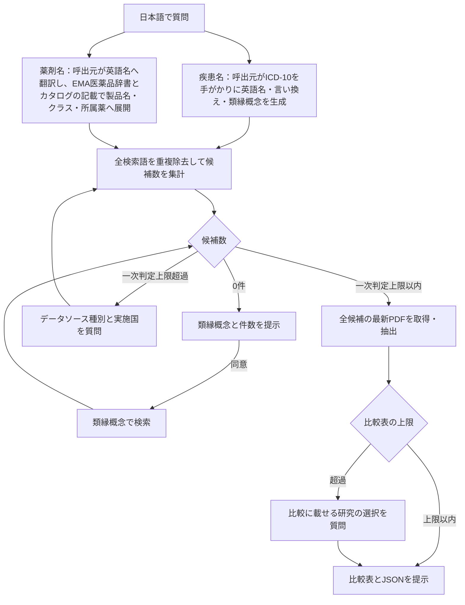
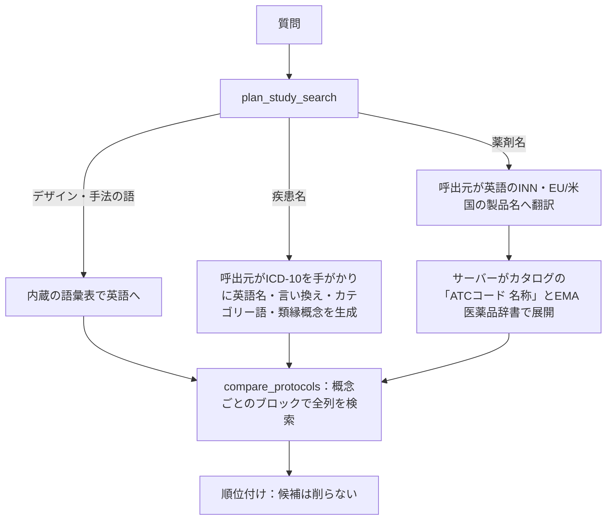

# EMA RWE MCP

**バージョン 0.5.4**。EMA Catalogueの **Non-interventional study**（介入を伴わない研究として明示的に分類された研究のみ）を検索し、Study documentsの最新プロトコルPDFから、研究デザイン・疾患定義・データソースを出典付き（PDFの物理ページ番号・逐語引用）で抽出・比較するPython MCPサーバーです。検索はローカルSQLite FTSと保存済み解析だけで行い、検索の中でのPDFの取得は選択した研究に限られます。EMAサイトの検索結果ページを無制限にクロールする仕組みではありません（例外は、利用者が実行する医薬品欄の補完コマンドだけです。後述）。

開発者（このMCP自体を改修する人）向けの情報は [README_DEV.md](README_DEV.md) にまとめています。

## 導入

uvがあれば、cloneせずにMCPクライアントへ登録できます。カタログDBとEMA医薬品辞書はパッケージに同梱され、初回起動時にOSのユーザーデータディレクトリへ複製されます。新しい版がより新しいカタログDBを同梱していれば、起動時にカタログだけを差し替えます（保存済みの解析結果は残ります。`EMA_DB_PATH`で別のDBを指定した場合は差し替えません）。

```json
{
  "mcpServers": {
    "ema-rwe": {
      "command": "uvx",
      "args": ["--from", "git+https://github.com/parfait0707/ema-rwe-mcp", "ema-rwe-mcp"]
    }
  }
}
```

[`.mcp.json.sample`](.mcp.json.sample)には、この内容を版`v0.5.4`に固定した形を置いています。版を固定するには `git+https://github.com/parfait0707/ema-rwe-mcp@v0.5.4` のようにタグを付けてください。

**必要なもの**: [uv](https://docs.astral.sh/uv/) と git。Python 3.12 は uv が自動で用意します。初回起動時にパッケージのビルドと同梱データ（約50 MB）の複製が走るため、数十秒かかることがあります。追加のAPIキーは不要です（サーバー側抽出を使う場合のみ、後述の`LLM_*`を設定します）。

### Claude Codeで使う

`.mcp.json.sample`をプロジェクト直下へ`.mcp.json`としてコピーするだけで登録されます。Claude Codeをそのディレクトリで起動し、プロジェクトMCPの初回確認に応答した後、`/mcp`で接続を確認してください。

### Codexで使う

[`.codex/config.toml.sample`](.codex/config.toml.sample)をプロジェクト直下へ`.codex/config.toml`としてコピーするだけで登録されます（先頭の「Public installation」ブロックがそのまま使えます）。Codexでプロジェクトを開き直し、`/mcp`で`ema-rwe`があることを確認します。このMCP自体を開発する場合の設定は[Codex設定ガイド](docs/codex-setup.md)を参照してください。

## 質問の仕方と流れ

日本語のまま質問できます。カタログの索引は英語なので、質問の中の概念はまず英語の検索語へ展開されます。疾患と薬剤では展開の経路が異なります。

- **疾患名**：疾患名の辞書は同梱していません。呼出元（Claude Code/Codex）がMCPの指示に従い、英語名・言い換え・コード候補・類縁概念を生成します。このときICD-10（WHO 2019）を**語彙の手がかり**として使います。該当する分類の名称と包含用語を同義語に、同じブロックの別分類を類縁概念に、ブロック・章の名称をカテゴリー語にします。ICD-10は検索語を漏れなく作るための足場で、RWDのコード体系とは別物です。呼出元が出すICD-10コードは未検証の検索ヒントです。各研究が実際に使ったコード体系（ICD-10-GM、Read、SNOMED CTなど）とコードは、PDFから引用付きで抽出します。
- **薬剤名**：ICD-10は使いません。日本語の薬剤名は呼出元が英語の一般名（INN）と製品名に訳します。それを同梱のEMA医薬品辞書が、成分構成が同じ製品名へ展開します。さらにカタログ自身の医薬品の記載（`(B01AF02) apixaban`のようなATCコード付きの記載）を使い、薬の上位クラス（例：Direct factor Xa inhibitors）を後方の候補として加えます。「抗てんかん薬」のようなクラスで聞かれた場合は、そのクラスに属する薬の名前で検索します。詳しくは[内部の探索ロジック](#内部の探索ロジック)を参照してください。ATCコードを調べる用途には対応しません。
- **研究デザイン・手法の語**（交絡、インデックス日、小児など）：内蔵の語彙表が英語に展開します。

`compare_protocols`は、概念ごと（例：曝露とアウトカム）に全検索式の候補をメタデータの全項目から広く集めます。依頼した疾患・薬剤の名前だけでなく、「心血管イベント」「免疫チェックポイント阻害薬」のようなカテゴリー名でしか書かれていない研究も拾い、定義を含んでいそうな研究から順に並べます。プロトコルが公開されていない研究や、PDFが画像だけで読めない研究は後ろに回します（候補からは外しません）。一次判定上限（`EMA_MAX_SCREENING_STUDIES`、既定5件）を超えると、MCPは**データソース種別（claims/ehr/registry/others）と実施国の両方**を、候補件数（facets）を示しながらユーザーに尋ねます。研究デザインや疾患条件でさらに絞ることもできます。一次判定上限以内になった研究は全件のPDFを取得・解析し、`EMA_MAX_COMPARISON_STUDIES`（既定5件）を超える場合は比較表に載せる研究をユーザーに選んでもらいます。

依頼した疾患・アウトカムの研究が0件のときは、PDFを取得せずに**臨床的な類縁概念**（上位概念・同じ分類の別疾患・合併症や関連病態）とその件数を提示します。医薬品が0件のときは、呼出元が渡したATCコードから、同じクラスとカタログにあるその所属薬を類縁概念として示します（概念が1つの検索のときだけ。複数の概念をANDで組んだ検索では、0件の概念だけで検索し直します）。ユーザーが同意すると類縁概念で検索し、比較表の「一致の根拠」行に「類縁概念での一致（依頼された概念そのものではない）」と明記したうえで、その定義を示します。国や種別の絞り込みで0件になっただけの場合は、先に絞り込みの緩和を提案します。



結果には根拠として、PDFの物理ページ番号と短い逐語引用が付きます。

## Use Case

研究デザインを考えるときに、他の研究がアウトカムやコホートをどう定義したかを、プロトコルの記載で確かめる使い方を想定しています。
以下の4例は、入力の型（疾患名だけ／疾患名と薬剤名）と、知りたい定義（アウトカム／コホート）の組み合わせです。
出力イメージは実際の出力の形式に合わせた例示で、研究ID・ページ・引用は説明用のプレースホルダーです。

### 1. アウトカム定義を探す：疾患名だけ

> 間質性肺疾患をアウトカムとした研究を探し、どのようなアウトカム定義を使ったかを教えて

呼出元は疾患名を英語へ展開し、アウトカムの概念を1ブロックとして渡します。

```json
{"blocks": [{"role": "outcome",
  "queries": ["interstitial lung disease", "ILD", "interstitial pneumonia", "pneumonitis", "pulmonary fibrosis"],
  "category_terms": ["diseases of the respiratory system", "respiratory adverse events"]}]}
```

候補が一次判定上限を超えると、MCPは件数の内訳を示して、データソース種別と実施国を尋ねます。

```text
間質性肺疾患に一致した研究は 83 件です（ローカル索引の件数）。
  データソース種別: claims 21 / ehr 30 / registry 12 / others 34
  実施国（上位）: Germany 25 / Spain 22 / United Kingdom 20 / Japan 6 …
どの種別と国に絞りますか？
```

絞り込んだ研究の最新プロトコルPDFを読み、比較表とJSONを返します。

```text
| 比較項目 | <研究A> | <研究B> |
|---|---|---|
| 一致の根拠 | 依頼概念での一致: interstitial lung disease | 依頼概念での一致: pneumonitis |
| Data source type | claims | ehr |
| Study design | コホート研究 (p. 12) | ネステッドケースコントロール研究 (p. 9) |
| 疾患定義・コード・観察期間・除外条件 | ILD: ICD-10 J84.1, J84.9 の入院主診断1回 (p. 18) | ILD: Read code H563.. の記録、ベースラインの既往を除外 (p. 21) |
| 根拠ページ | 18, 19 | 21 |
| 未記載・未確認事項 | 確定診断の検証方法の記載なし | — |
```

### 2. アウトカム定義を探す：疾患名と薬剤名

> SGLT2阻害薬の使用者で、糖尿病性ケトアシドーシスをアウトカムとした研究のアウトカム定義を知りたい

呼出元は曝露とアウトカムを別のブロックにします（ブロック間はAND）。薬のクラスは、クラス名と第3・第4レベルのATCコードを渡します。

```json
{"blocks": [
  {"role": "exposure", "queries": ["SGLT2 inhibitors", "gliflozins", "A10BK"]},
  {"role": "outcome", "queries": ["diabetic ketoacidosis", "DKA", "ketoacidosis"]}]}
```

MCPはクラスを所属薬の名前へ展開し、何を加えたかを`medicine_expansion`で返します。

```json
"medicine_expansion": [{"block": 0, "query": "A10BK", "atc_codes": ["A10BK"],
  "queries": ["Sodium-glucose co-transporter 2 (SGLT2) inhibitors", "canagliflozin", "dapagliflozin",
              "empagliflozin", "ertugliflozin"],
  "category_terms": [], "omitted": 0}]
```

比較表の「一致の根拠」には、どの語で一致したか（例：`dapagliflozin`）が出ます。語の出所（例：EMA医薬品辞書の所属薬なら`ema_medicines`、カタログのクラス名なら`catalogue_atc`）は、候補の`matched_term_sources`と比較JSONの`match.sources`に出ます。所属薬の名前で一致した研究も、依頼したクラスの研究として扱います。

### 3. コホート定義を探す：疾患名だけ

> 心不全患者を対象にしたコホート研究で、コホートの組入・除外基準とインデックス日の決め方を知りたい

呼出元は疾患を対象集団の概念（`role: "condition"`）として渡し、研究デザインの語（コホート研究）は内蔵の語彙表が英語に展開します。

```json
{"blocks": [{"role": "condition",
  "queries": ["heart failure", "cardiac failure", "congestive heart failure", "HFrEF", "HFpEF"],
  "category_terms": ["cardiovascular disease"]}],
 "filters": {"study_designs": ["cohort"]}}
```

コホート定義は、比較表の専用の行にまとまります。

```text
| 比較項目 | <研究A> |
|---|---|
| コホート定義（組入・除外・インデックス日・ベースライン・追跡） | 組入: 心不全の入院主診断 (p. 14) / 除外: 先天性心疾患 (p. 15) / インデックス日: 初回入院の退院日 (p. 14) / ベースライン: インデックス日前365日 (p. 16) / 追跡: 死亡・転出・研究終了まで (p. 17) |
| 設計図（ページ・時間窓） | figure p. 13 / 除外期間 −365〜−1日 (p. 16) |
```

### 4. コホート定義を探す：疾患名と薬剤名

> 関節リウマチでJAK阻害薬を新たに開始した患者のコホートを、ほかの研究はどう定義している？

```json
{"blocks": [
  {"role": "condition", "queries": ["rheumatoid arthritis"]},
  {"role": "exposure", "queries": ["JAK inhibitors", "Janus kinase inhibitors", "JAKi", "L04AF",
                                   "tofacitinib", "baricitinib", "upadacitinib", "filgotinib"]}]}
```

結果には、入力した薬が本剤群の研究だけでなく、比較群として定義された研究も含まれます。比較群の定義も、コホートを設計するときの参考になるためです。どちらの役割かは、PDFから抽出した曝露（`exposure`）と比較群（`comparator`）の欄で確かめてください。

## 内部の探索ロジック

検索の対象はEMAカタログのメタデータ（英語）です。
質問の中の概念は、まず英語の検索語に展開されます。
疾患名と薬剤名では、展開の担い手と手がかりが違います。



### 疾患名を含む場合

1. `plan_study_search`は疾患名の辞書を持たないため、日本語の疾患名には`needs_client_translation`を返します（利用者が辞書を`data/dictionaries/`に置いた場合は、その辞書で展開します）。
2. 呼出元は、指示に従ってICD-10（WHO 2019）を語彙の手がかりに使います。該当する分類の名称と包含用語を`queries`に、ブロック・章の名称や包括的なアウトカム名（MACEなど）を`category_terms`に入れます。除外（Excludes）の語は使いません。同じブロックの別分類は類縁概念（`sibling`）、ブロック・章は上位概念（`broader`）です。
3. `compare_protocols`は、各検索語を1つの語句としてカタログの全列で検索します。複数語の語句は、語が同じ列の中で近くに現れること（FTS5の`NEAR`）を条件にします。ICD-10コードは小数点の有無の両方で照合しますが、カタログにはほとんど現れません。
4. 0件のときは検索を広げずに、類縁概念とその件数を示します（`analogous_fallback`）。

### 薬剤名を含む場合

1. 日本語の薬剤名は呼出元が英語に訳します。呼出元は、INN、EU・米国の製品名、略語（TNFi、DOACsなど）、語形やハイフン表記の変種も渡します。
2. サーバーは各検索語を、EMA医薬品辞書とカタログの医薬品名に、1つの医薬品名として語全体で照合します。長い語の一部では展開しません（例：GLP-1受容体作動薬の語からglucagonの製品へは展開しない）。検索語の末尾の塩・エステルの語（citrate、maleate、hydrochlorideなど）は除いて照合します（例：tofacitinib citrate → tofacitinibの製品）。カタログ本文の全文検索そのものは語単位なので、glucagon-likeを含む研究はglucagonでも一致します。これは検索の手がかりで、塩と遊離体を同じ製剤とはみなしません。
3. 名前どうしの対応は2つの情報源から得ます。
   - **EMA医薬品辞書**：製品名とINNを、成分の組み合わせ全体が同じ製品どうしで展開します。合わせ剤は単剤と同一視しません。
   - **カタログ自身の記載**：exposures欄の`(B01AF02) apixaban`のような「ATCコード 名称」の組です。
4. ATCコードは名前どうしをつなぐ内部の手がかりとしてだけ使い、情報源をまたいでコードで照合することはしません。コードの名称はカタログの記載から引きます。EMA医薬品辞書の記録が持つATCコードは、記録の名前とカタログのそのコードの名称が同じ薬か、名前が広い・狭いだけの関係のときだけ、カタログの名称やクラスへの手がかりに使います（辞書のコードがカタログでは別の薬に付いていることがあるため。コードだけで照合することはしません）。辞書のコードそのものは検索語には使わず、取得したプロトコルPDFの中を探すときのヒントにも使います。版の違うコード（例：afatinibのL01XE13とL01EB03）は、同じ名前でまとまります。
5. 展開のしかたは入力によって変わり、加えた語は`medicine_expansion`に返ります。
   - **成分・製品**（第5レベル）：カタログ上の名称を検索語に加えます（カタログの名称の方が広い、たとえば株や型を書かない名称のときは、検索語ではなく`category_terms`に加え、記録に無い株や型を書く狭い名称のときは加えません）。上位の第4レベルのクラス（コードと名称）は`category_terms`として加え、クラス名でしか書かれていない研究を後方の候補として拾います。
   - **クラス**（カタログのクラス名称と完全に一致するクラス名、または第3・第4レベルのATCコード）：クラスの名称と、カタログとEMA医薬品辞書でそのクラスに属する薬の名前を、検索語に加えます（1問あたり100語まで）。カタログがそのコードを別の名前で記録しているEMAの記録は加えず、`omitted_members`に理由とともに返します（名前がATCの名称と違うだけの所属薬と、辞書のコードの誤りがあるため。呼出元がクラスに属すると判断したものを加えて検索し直します）。
6. 該当する研究が0件で、呼出元が第5レベルのATCコードを渡していた場合は、同じクラス（第4レベルに名称が無ければ第3レベル）とカタログにある所属薬を類縁概念として示します。類縁概念の候補も、通常の検索と同じ順位付けで並べます。
7. カタログの医薬品欄が空の研究（712件）のうち215件は、補完コマンド（後述）で医薬品を補っています。補った薬は医薬品の列で検索され、候補の`observed_exposures`に出所付きで出ます。
   - **`protocol_pass_table`**（76件）：プロトコルのPASS情報表の「Active substance」「Medicinal product」欄に書かれた、既知の薬の名前、カタログのクラス名（例：`DIURETICS`）、欄に書かれたATCコード。名前の分からない薬（辞書に無い薬）は、欄に書かれたATCコードで記録します。カタログにそのコードの名称があればその名称を、無ければコード自体（例：`A07DA03`）を名前にし、コードでも検索できます。プロトコル本文のATCコードは、除外基準・アウトカム・共変量にも使われるので記録しません。
   - **`catalogue_text`**：題名・説明・目的に書かれた既知の薬の名前。比較対照や除外基準の薬であることもあるので、プロトコルで確かめてください。研究の略称と同じ名前（`SONATA study`）、検査値として書かれた物質名（呼気NO）、受容体や阻害薬のクラス名の一部（`angiotensin II receptor blockers`の angiotensin II）は補いません。

### 順位付け

候補は削らずに、次の順で並べます。

1. プロトコルが公開されていないと確認された研究、テキスト層の無いPDF（画像だけ）の研究は最後（PDFの取得で分かった事実はカタログとは別に保存され、カタログを更新しても消えません）
2. 固有の語で一致したブロックが多い研究（カテゴリー語だけの一致は後ろ）
3. 役割の列（題名と、Outcomes・Medicinal condition・薬剤欄など役割ごとの列）で一致したブロックが多い研究
4. CSVにプロトコルの所在（Protocol file・URL）がある研究、または取得でプロトコルが見つかった研究
5. 二次利用データ（カタログの種別タグあり）の研究を前に、調査（題名にsurvey）・横断研究を後ろに
6. 検索語ごとのBM25順位を統合した値（RRF、k=20）

## 結果の読み方

- **「計画中（planned）」と「使用済み（used）」は区別されます。** プロトコルは計画書なので、`usage`は`used`/`planned`/`candidate`/`unclear`のいずれかです。計画書に使用予定と書かれたデータソースを、実際に使用したとは断定しません。
- **どの語で見つかった研究かが分かります。** 各候補には`match_basis`（`concept`＝依頼した概念そのもの／`analogous`＝類縁概念）、`matched_terms`（一致した語）、`matched_term_sources`（語の出所：呼出元が生成した語、利用者の辞書、EMA医薬品辞書など）が付きます。類縁概念で見つかった研究の定義は、依頼した概念の定義ではありません。
- **`observed_exposures`は補完した医薬品です。** カタログの値ではなく、出所（`protocol_pass_table`＝PASS情報表、ページ付き／`catalogue_text`＝題名などの文章）を示します。`term`が薬の名前でなくクラス名やATCコードのこともあります。その研究で曝露として使われたかは、プロトコルで確かめてください。
- **呼出元が生成した英語名やICD-10コードは検証されていない検索ヒントです。** 研究で実際に使われたコードや定義は、PDFの引用で確認してください。
- **候補数はローカル索引の一致件数です。** EMA全体の件数でも、未取得PDFの本文まで検索した結果でもありません。
- **`data_source_types`（カタログ由来）と`protocol_source_assessments`（PDF由来）は別物です。** 前者はEMA検索画面でclaims/ehr/registryを限定してexportしたCSVから付与した種別タグ、後者はプロトコル本文を読んで判定した根拠付きのデータタイプです。両者が一致しない場合は`catalogue_protocol_disjoint=true`が付きますが、これは意味の誤りを断定するものではなく、差異の確認用です。
- **`missing_information`は「わからなかったこと」を明示する欄です。** 本文にヒットがないことは「記載がない」ことの証明ではないため、調査範囲と理由がここに残ります。

## 2つの動作モード

追加のAPIキーなしでも使えますが、コストとスピードを重視する場合はサーバー側抽出を設定できます。ユーザーが選ぶものです。

| モード | 内容 |
|---|---|
| **追加APIキーなし（既定）** | 呼出元（Claude Code/Codex）自身がPDF本文を読んで抽出します。PDF本文が会話コンテキストに積まれるため費用が高くなります（242頁のプロトコルで1問あたり100 turn超・$20超）。Claude Codeでは、MCPの案内に従って研究ごとの読み取りをSonnetサブエージェントへ委譲する運用にしています。 |
| **サーバー側抽出** | シェルの環境変数またはMCPクライアントの`env`に`LLM_MODEL`と、`LLM_BACKEND=litellm`または`LLM_BASE_URL`（OpenAI互換のエンドポイント）を設定し、必要に応じて`LLM_API_KEY`、`LLM_REASONING_EFFORT`、`LLM_MAX_TOKENS`を設定すると、MCPプロセス自身が設定先LLMでPDFを抽出します。Azure OpenAIのv1エンドポイントを使う場合は`LLM_MODEL=openai/<deployment>`とします。 |

**大きめのプロトコル（100頁超）を複数比較する場合は、サーバー側抽出の設定を推奨します。** PDF本文を呼出元の会話コンテキストへ積まないため、同じ質問でも所要時間・コストの両方が下がります。

| 質問 | モード | 壁時計 | コスト（Claude側） |
|---|---|---:|---:|
| q1: 日本のレセプトでの膵炎アウトカム定義 | サーバー側抽出（Azure OpenAI, gpt-5.6, effort=high） | 17分 | $4.00 |
| q1: 同上 | 追加APIキーなし（Sonnetサブエージェントへ委譲） | 28分 | $22.04 |
| q2: 心不全患者コホート定義 | サーバー側抽出（同上） | 18分 | $5.05 |
| q2: 同上 | 追加APIキーなし（Sonnetサブエージェントへ委譲） | 32分 | $24.22 |

実測はheadless Claude Codeでの各質問1回の実行（詳細と実行条件は[docs/validation.md](docs/validation.md)の2026-09-25の記録）。盲検採点では両モードの抽出品質は同程度〜僅差で、優劣は一定していません。この差は主に「PDF本文をどちらが読むか」によるコストとスピードの差であり、精度面でサーバー側抽出が優れていることを意味しません。

ユーザーが触る主な環境変数は次のとおりです（全一覧は[README_DEV.md](README_DEV.md)）。

| 環境変数 | 既定値 | 内容 |
|---|---:|---|
| `EMA_MAX_SCREENING_STUDIES` | 5 | PDF取得・全件解析に進める最大研究数 |
| `EMA_MAX_COMPARISON_STUDIES` | 5 | 比較表へ掲載する最大研究数 |
| `LLM_BACKEND` | `compatible` | `compatible`（`LLM_BASE_URL`のOpenAI互換エンドポイント）または`litellm`。どちらも`LLM_MODEL`があればサーバー側抽出になる |
| `LLM_MODEL` / `LLM_BASE_URL` / `LLM_API_KEY` | (空) | 接続先LLMの指定 |
| `LLM_REASONING_EFFORT` / `LLM_MAX_TOKENS` | (空) / `0` | reasoningモデルの強度・出力上限 |
| `EMA_PROTOCOL_DIR` | DBと同じ親フォルダ内の`protocols` | 取得したPDFの保存先 |
| `EMA_TERMINOLOGY_PATH` | (空。データフォルダ内`dictionaries/*.json`があれば読む) | 独自の言い換え・マスターの辞書（任意、書式は`data/terminology.example.json`） |

## カタログの更新（任意）

**2026-10-01にカタログデータを更新しました**（v0.3.2）。同日のEMA公式CSV exportから作り直し、Non-interventional studyは3,314件（claims 819件、EHR 916件、registry 559件、種別タグなし1,511件）です。v0.3.1以前を`uvx`で使っている場合は、`.mcp.json.sample`と同じ版（`@v<版>`）に変えて再起動すると、キャッシュ済みの解析と回答を残したままカタログだけが入れ替わります。v0.5.1では、同梱DBの医薬品欄の補完結果を新しい抽出規則で作り直しました。v0.5.0の結果を取り込み済みの手元のDBも、起動時に新しい結果へ置き換わります（手元で補った他の出所の値はそのまま残ります）。

同梱のカタログDBは**2026-10-01時点**のNon-interventional study全件です。最新の研究を検索対象に加えたい場合だけ、[EMA検索ページ](https://catalogues.ema.europa.eu/search?f%5B0%5D=content_type%3Adarwin_study)のExport ResultsでCSVを取得し、`import_catalogue_csv`で取り込みます。CSVを一度も取り込んでいない、または全研究か取り込んだ種別のエクスポートのどれかが`EMA_CATALOGUE_TTL_SECONDS`（既定30日）を過ぎていて、検索候補が0件だった場合は、Playwright MCPを併用して呼出元が表示ブラウザでEMA公式のExportを1回実行し、そのCSVを取り込む経路も使えます。手順の詳細（必須列・ファイル名規約・Playwright併用の理由）は[README_DEV.md](README_DEV.md)を参照してください。

## できないこと・注意

- **EMAサイトの検索結果ページを自動クロールしません。** `/search/`配下はrobots.txtで禁止されており、CSVはユーザー起点の表示ブラウザ操作でのみ取得します。
- **検索の中でPDFを取得するのは、一次判定上限以内になった研究だけです。** サイト全体のPDFを収集する処理ではありません。
- **例外：医薬品欄の補完コマンド。** `ema-rwe backfill-protocols`は、カタログの医薬品欄が空で、CSVにプロトコルの所在がある研究だけについて、プロトコルを1件ずつ取得し、PASS情報表の有効成分名・クラス名と、欄に書かれたATCコードを補います（本文のATCコードは、除外基準や共変量のこともあるので使いません）。研究の間を既定で60秒空け、429や通信障害が続いたら止まり、再実行すると続きから補います。利用者が実行するときだけ動き、検索の途中では動きません。同梱DBには、この補完の結果（成分名・ATC・ページ番号。引用文は含まない）を入れて配布しています。新しいCSVを取り込んだ後に実行すると、欠けている研究だけを補います。抽出の規則を直した版では、同梱DBの補完結果が、利用者のDBにある古い規則の結果を置き換えます。
- 取得したPDFは`EMA_PROTOCOL_DIR`（既定はDBと同じ親フォルダ内の`protocols`）にID付きで保存され、ユーザーが削除するまで保持されます。英語以外のプロトコルの見出しの英訳は、検索用のDBに保存されます（以前の版がPDFの隣に置いた`.headings`は一度だけ取り込みます）。
- **英語以外のプロトコルは、抽出の前に見出しを英訳します。** 節の役割（背景・参考文献・方法など）は英語の見出しの語で判定するためです。既定のモードでは呼出元が英訳し（`analyze_protocol`が`needs_heading_translation`と見出しの一覧を返します）、サーバー側抽出では設定先のLLMが英訳します。英訳は節の役割の判定だけに使い、本文の読解には使いません。英訳でも役割の分からない節は読みます。そのため、英語以外のプロトコルは英語のものより読む量が多くなります。
- **プロトコルは「最新版」を自動選択します。** Study documentsの「Updated protocol」欄の文書を、それ以外のプロトコル欄の文書より優先し、同じ分類内は版番号・文書日付・公開日で選びます。判断根拠は結果の`selection_reason`に残ります。取得結果は30日間キャッシュされるため、最新性が重要な調査では`get_protocol`・`get_study`に`refresh=true`を指定してください（`analyze_protocol`の`force_refresh=true`は、保存済みの解析も捨てて読み直します）。
- 医薬品辞書（商品名⇄INN/common name⇄ATC）が古い場合は`refresh_drug_dictionary`で更新できます。
- 疾患名の英訳・類義語・類縁概念は呼出元LLMの知識に依存するため、同じ質問でも実行ごとに候補数が変わることがあります。安定させたい場合は、独自の辞書を`data/dictionaries/`に置いてください。
- サーバー側抽出を使う場合、選択したプロトコルの関連本文と質問文が設定先のLLMプロバイダへ送信されます。追加APIキーなしのモードでも、PDF本文は呼出元（Claude Code/Codex）の提供元へ送られます。

## データの出所とプライバシー

- カタログのスナップショットは [HMA-EMA Catalogues of real-world data sources and studies](https://catalogues.ema.europa.eu/)（accessed October 2026）の公式CSV export（2026-10-01）から作成しています。出典：European Medicines Agency（© EMA）。連絡先の列は取り込まず、索引にも含めていません。
- 研究の登録内容は製薬企業・研究者・機関が入力したもので、第三者が著作権を持つ場合があります。再利用には[カタログのLegal notice](https://catalogues.ema.europa.eu/legal-notice)と[EMAのLegal notice](https://www.ema.europa.eu/en/about-us/about-website/legal-notice)が適用されます。
- 医薬品辞書はEMA公式の医薬品データです（`data/`）。疾患名の辞書は同梱せず、日本語の疾患名はMCPクライアント（Claude Code、Codex等）がICD-10を手がかりに英語名・言い換え・コード候補へ翻訳します。日本語の薬剤名はクライアントが英語名へ翻訳し、医薬品辞書が展開します。独自の言い換えやマスターを使う場合は`data/dictionaries/`にJSON辞書を置きます（書式は`data/terminology.example.json`）。
- プロトコルPDFは選択した研究についてのみ、間隔制御・robots確認付きでEMAサイトから取得し、あなたのPCに保存されます。本文はLLM（呼出元のClaude Code/Codex、または設定したサーバー側プロバイダ）へ送信されます。
- このツールは研究デザインの参考情報を出典付きで整理するもので、出典の確認なしに研究設計へ転用しないでください。

## 不具合報告

[GitHub Issues](https://github.com/parfait0707/ema-rwe-mcp/issues) へ、質問文・研究ID・`missing_information`の内容を添えて報告してください。ライセンスは [MIT](LICENSE) で、ソースコードだけに適用されます。同梱のEMAデータ（`data/ema.sqlite3`、`data/ema-medicines.json`）とテスト用の断片には適用されず、出典と条件を[NOTICE](NOTICE)に記載しています。

## 詳細ドキュメント

- [docs/mcp-workflow.md](docs/mcp-workflow.md): 呼出元エージェントが従う手順の正本（英語。読み手はツールを操作する呼出元のモデル。MCPリソース`ema-rwe://docs/mcp-workflow`としても返すので、`uvx`で導入した環境でも呼出元が読めます）
- [docs/clinical-search.md](docs/clinical-search.md): 日本語疾患名・薬剤名から英語・医療コードへの展開
- [docs/comparisons.md](docs/comparisons.md): 複数プロトコルの比較・絞込の詳細
- [docs/source-types.md](docs/source-types.md): PDF由来データタイプの判定・優先順位

このMCP自体を開発・改修する場合は[README_DEV.md](README_DEV.md)を参照してください。
