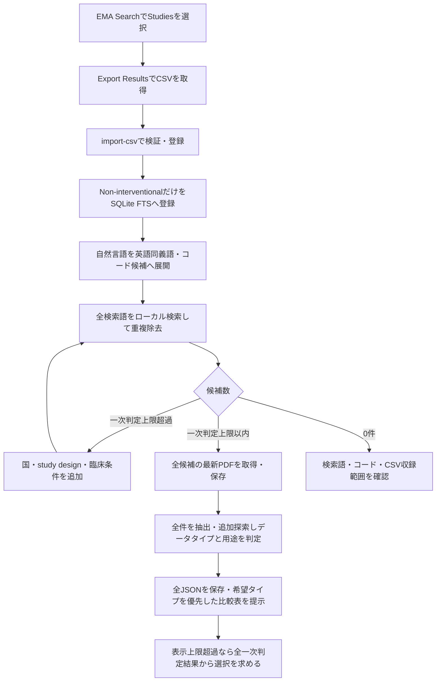
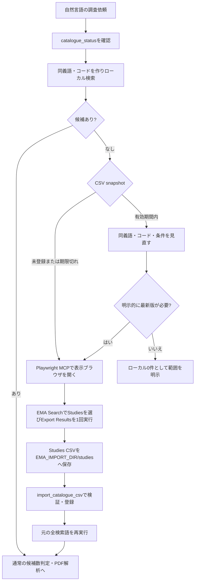

# EMA RWE MCP

EMA Catalogueの **Non-interventional study** を検索し、Study documentsの最新プロトコルPDFから、研究デザイン・疾患定義・データソースを出典付きで抽出・再利用するPython MCPサーバーです。Core、CLI、MCPを分離しています。

`docs/spec/v0.1.md` と追加要件に基づくv0.6実装です。追加探索の仕様は [docs/spec/v0.2.md](docs/spec/v0.2.md)、医薬品・コード検索は [docs/clinical-search.md](docs/clinical-search.md)、複数研究の比較は [docs/comparisons.md](docs/comparisons.md) を参照してください。通常検索はSQLite FTS5/BM25だけで実行し、PDFは選択した研究についてのみ取得します。

## セットアップ

このチェックアウト用のCodex MCP設定は [`.codex/config.toml`](.codex/config.toml)、開発ルールは [`AGENTS.md`](AGENTS.md) です。[Codex設定ガイド](docs/codex-setup.md)を参照してください。

日本語の疾患名から英語の関連語・医療コードへ検索を広げる機能を追加しています。`J84.9`／`J849`などの表記揺れ、呼出元が指定するコード、独自辞書、LLMによる候補提案に対応します。具体例と網羅性の制約は [臨床概念・医療コード検索](docs/clinical-search.md) を参照してください。

Python 3.12以上とuvを利用します。

```powershell
uv venv --python 3.12
uv sync --extra dev
$env:EMA_DB_PATH = "E:/codex/rwd-catalogue-mcp/data/ema.sqlite3"
$env:EMA_CACHE_DIR = "E:/codex/rwd-catalogue-mcp/cache/http"
$env:EMA_IMPORT_DIR = "E:/codex/rwd-catalogue-mcp/data/imports"
.venv/Scripts/ema-rwe --help
```

別の場所にcloneした場合はパスを置き換えてください。Windows以外では `.venv/bin/ema-rwe` を使用します。`EMA_DB_PATH`未設定時はチェックアウト内の`data/ema.sqlite3`（Git管理のカタログDB）を使い、wheelとして導入した場合だけOSのユーザーデータディレクトリへ退避します。キャッシュ等はOSのユーザーキャッシュディレクトリが既定です。`.env.example` は設定例で、自動読込はしません。

`data/ema.sqlite3`にはNon-interventional study全件と、claims／ehr／registryのData source typeタグを取り込んだ状態でコミットしてあります。cloneした直後から検索と絞り込みが使えます。再構築する場合は後述の`ema-rwe import-all`を実行します。

## 1. 公式CSVで検索対象を登録

[EMA検索ページ](https://catalogues.ema.europa.eu/search?f%5B0%5D=content_type%3Adarwin_study)のStudies用Exportから、必要な研究のCSVをブラウザでダウンロードします。

### CSVを事前登録する場合



```powershell
.venv/Scripts/ema-rwe import-csv ./export-data.csv
.venv/Scripts/ema-rwe search "opioid cohort" --limit 5
.venv/Scripts/ema-rwe search "diabetes" --all-studies
```

- `Non-interventional study` / `Non-interventional` と明示された研究だけ取り込みます。種別不明・介入研究は除外します。
- URL中の `content_type:darwin_study` は研究レコード種別です。DARWIN EU研究限定とは異なります。`darwin_only=true`（CLIの既定）は独立したDARWIN EUフラグを判定します。
- 元CSVのバイト列、SHA256、ファイル名、取込時刻を保存します。研究ID単位のupsertであり、今回のCSVにない既存研究は削除しません。
- 必須列は `Study ID`, `Official title and acronym`（公式CSVでは`Title`）, `Study type`。別名の対応は `storage.py` の `ALIASES` を参照してください。不一致はエラーになり、黙って0件登録しません。
- 列名が異なる場合は `--column-map ./columns.json` を使用します。例: `{"study_id":"Study identifier","title":"Title","study_type":"Type"}`。
- `Data sources (types)` / `Data source type` 列があれば取り込みます。2026-09-12のStudies exportにはData source type列がなかったため、そのsnapshotでは空欄として明示し、選択研究のdetail pageで補完します。
- `Data source(s)`と`Other linked data sources`はカタログ上のデータソース候補として取り込みます。ATC、INN/common name、疾患、outcome、目的などの公開臨床metadataも候補検索だけに索引化します。連絡先は索引化しません。
- 複数値の区切りは `|`・`;`・改行です。値内部のカンマは分割しません。実CSVの構造・欠損率は [CSV実データ調査](docs/csv-profile-20260912.md) に記録しています。
- Data Sources CSVの取込・結合は不要です。データタイプは候補PDFの該当用途からLLMで判定し、公式のStudy分類と分けて保存します。[データタイプの比較仕様](docs/source-types.md)を参照してください。過去の[Data Sources結合検証](docs/data-source-linkage-20260912.md)は調査履歴です。
- 原本CSVに連絡先が含まれる場合があります。原本は検索対象から分離され、連絡先専用列をDB／FTS／検索結果には入れません。

### CSVを事前登録せず質問する場合

Microsoft公式の[Playwright MCP](https://github.com/microsoft/playwright-mcp)を**呼出元用の別MCP**として併用できます。Playwright MCPはアクセシビリティツリーとDOMを使って画面を操作でき、CodexとClaude Codeの双方から利用できます。ブラウザをPythonサーバーへ埋め込まず、画面操作を呼出元へ分離することで、DOM変更時にLLMが要素を再探索でき、rwd-catalogue-mcpの検索・検証・保存処理も単独で利用できます。



0件になるたびにCSVを取得すると、同じCSVを繰り返しダウンロードする可能性があります。そのため、MCPは次の条件でブラウザ更新を推奨します。

- CSVを一度も取り込んでいない。
- 最新CSVの取込から `EMA_CATALOGUE_TTL_SECONDS`（既定30日）が経過し、検索候補が0件だった。
- ユーザーが最新カタログでの再確認を明示した。

CSVが有効期間内なのに0件なら、先に英訳・同義語・ICD-10/ATC・絞込条件を見直します。同じsnapshotを再取得しても候補は増えないためです。既知のStudy IDはCSVなしでも `get_study` / `analyze_protocol` で直接登録できます。

`EMA_IMPORT_DIR`はCSV importのルートです（既定は`EMA_DB_PATH`と同じ`data/`配下の`imports/`）。Non-interventional study全件のStudies exportは`studies/`へ、検索画面でData source typeをclaims／EHR／registryに限定したexportは`source_type/`へ保存します。Studies exportにはData source type列がないため、`source_type/`のファイル名に埋め込んだ種別だけがタグの根拠です。ファイル名は`<日付>_<claims|ehr|registry>_export-data.csv`とし、種別トークンが1つだけ含まれる必要があります。Data Sources exportは不要です。

`import_catalogue_csv(filename)`は`studies/`と`source_type/`直下のCSVファイル名だけを受け付け、移行用にルート直下も読みます。任意パスは受け付けません。50 MiB上限、必須列、UTF-8、Study ID重複、研究種別を検証し、原本・SHA256・取込日時を保存します。`source_type/`のファイルは各研究の`data_source_types`に種別を追加し（複数種別は累積）、その後に全件exportを再取込してもタグは保持されます。CLIの`ema-rwe import-all`は`studies/`、`source_type/`の順に全CSVを取り込みます。

```text
data/
├── ema.sqlite3                          # Git管理のカタログDB（clone直後から検索可能）
└── imports/
    ├── studies/     20260913_all_export-data.csv        # Non-interventional 全件（Git管理外）
    └── source_type/ 20260913_claims_export-data.csv     # Data source type = claims で絞ったexport
                     20260913_ehr_export-data.csv
                     20260913_registry_export-data.csv
```

CSV本体はGit管理外で、空フォルダだけを`.gitkeep`で保持します。

このリポジトリの [`.codex/config.toml`](.codex/config.toml) には、2026-09-12時点のPlaywright MCP `0.0.80`を、表示ありのMicrosoft Edgeと `data/imports/studies` 出力先で登録しています。初回は`npx`がパッケージを取得するためネット接続が必要です。バージョンを固定しているため、更新はrelease内容を確認して明示的に行います。別環境用のCodex設定例:

```toml
[mcp_servers.playwright]
command = "npx"
args = ["-y", "@playwright/mcp@0.0.80", "--browser", "msedge", "--output-dir", "E:/codex/rwd-catalogue-mcp/data/imports/studies"]
enabled = true
startup_timeout_sec = 60
tool_timeout_sec = 180
```

Claude Codeでは次のようにプロジェクトへ追加します。

```powershell
claude mcp add --transport stdio --scope project playwright -- npx -y @playwright/mcp@0.0.80 --browser msedge --output-dir E:/codex/rwd-catalogue-mcp/data/imports/studies
```

Linux/macOSでは利用可能なブラウザを指定し、必要ならPlaywrightのブラウザをインストールしてください。EMAの画面変更、ダウンロード確認、CAPTCHA等で自動操作を継続できない場合は、表示ブラウザでユーザーがExportを完了し、その後の取込から再開します。

`Export results`はサーバー側のbatch処理になることがあります。呼出元は同じ進捗画面を待ち、CSVのダウンロード完了後に返されたファイル名を`import_catalogue_csv`へ渡します。進捗が遅くても新しいExportを重ねて開始しません。実サイト確認では開始27秒後で3%、推定残り約17分と表示されたため、1回のMCP tool timeout内に完了する前提にはしていません。

2026-09-12に確認した [robots.txt](https://catalogues.ema.europa.eu/robots.txt) は `/search/` 配下を禁止しています。このためrwd-catalogue-mcp自身は検索結果ページやExport URLをHTTPでクロールせず、定期バックグラウンド同期もしません。ブラウザ経路はユーザーが開始した調査で公式の画面手順を1回実行するためのものです。EMAの[Support FAQ](https://catalogues.ema.europa.eu/support)も、Searchでrecord typeを選び、`Export Results`からCSVを取得する手順を案内しています。

### CSVは直接取得せず、PDFは保存できる理由

対象と取得方法が異なります。

| 項目 | 公式CSV | プロトコルPDF |
|---|---|---|
| 発見元 | `/search/`の検索結果とExport操作 | 既知のStudy IDのStudy documents |
| robotsの扱い | `/search/`配下が明示的にDisallow | Studyページ、Study documents、`/system/files/`の対象PDFは同じ禁止対象ではない |
| 取得量 | 検索母集団全体のmetadata export | 一次判定上限（既定5件）以内の研究の最新版だけ |
| MCPの取得方法 | 直接HTTP取得を行わず、ユーザー起点の表示ブラウザ操作 | 識別可能なUser-Agent、間隔制御、robots確認付きでオンデマンド取得 |
| 保存目的 | ローカル検索用snapshot。原本とchecksumを保持 | 引用再確認・追加探索・版差替え検出。Study ID＋SHA256の不変IDで保持 |

PDF保存は「サイト全体のPDFを収集する」処理ではありません。ローカル候補が一次判定上限（既定5件）以内になってから、その研究のStudy documentsに掲載された最新版だけを取得します。取得時にも各URLのrobots判定、EMA HTTPSホスト制限、サイズ・ページ数制限、最低2秒間隔を適用します。CSV Exportは入口が禁止対象の `/search/` 配下なので、同じHTTPクライアントから自動取得しない設計です。

## 2. プロトコルの抽出と再利用

```powershell
.venv/Scripts/ema-rwe study 1000000479
.venv/Scripts/ema-rwe protocol 1000000479
.venv/Scripts/ema-rwe analyze 1000000479
```

抽出は2つの方式を提供します。

**追加APIキーなし（既定）**: `analyze_protocol` が関連セクション・物理PDFページ番号・抽出JSON Schema・fingerprintを返します。呼び出し元のClaude Code/Codexが全バッチを読み、`cache_protocol_analysis` で構造化結果を保存します。`next_offset` がある間は `analyze_protocol(offset=next_offset)` を繰り返します。保存済みの場合は `analyze_protocol` が即座に解析結果を返します。

**内部LLM**: `LLM_BACKEND=compatible`では`LLM_BASE_URL`（`/v1`等まで）、`LLM_MODEL`、必要なら`LLM_API_KEY`を設定し、Chat Completions互換APIを呼びます。`LLM_BACKEND=litellm`ならGemini・Anthropic・OpenAI・Azure OpenAI・Amazon Bedrockへ接続できます。[設定例と追加探索](docs/exploration.md)を参照してください。compatible方式は`response_format: json_object`対応モデルが必要です。LiteLLM方式ではJSON生成を指示し、返却後にスキーマを検証します。関連セクションを45,000文字以下のバッチに分割して抽出し、検証後に保存します。プロトコルの関連テキストは設定先プロバイダに送信されます。外部APIはキー未設定のため今回の実API検証は未実施です。

保存対象は、研究デザイン、対象集団、曝露、比較群、アウトカム、統計解析、疾患定義、データソース、補足事項です。疾患定義には、記載されていればコード体系・コード・観察期間・判定アルゴリズムを残します。OMOPへの自動変換や記載のないコードの補完は行いません。

各事実に短い原文引用・PDFの物理ページ番号・セクションを付けます。引用の存在、ページ、指定されたセクションをコードで検証します。データソース名は引用中に存在する名前に限定します。研究・PDF URL、版、取得日時、SHA256、抽出方式、schema versionは共通の `source` に保持します。引用が存在することは、要約や使用区分の意味が正しいことの保証ではありません。

## 検索結果の必須データソース情報

全検索結果に次のキーが含まれます。

| キー | 内容 |
|---|---|
| `data_source_types` | カタログのData source type。種別限定exportから付与した`claims`／`ehr`／`registry`タグ、または詳細ページの分類。どちらもなければ空配列（絞り込みでは`others`） |
| `data_source_types_status` | `available` / `not_provided` |
| `catalogue_data_sources` | カタログ上の名称。プロトコル本文由来と混同しないため別欄 |
| `protocol_data_sources` | プロトコル本文由来の名称・使用区分・引用・ページ |
| `protocol_source_assessments` | PDF由来のデータタイプ・定義用途・明示／推定・連結依存・根拠 |
| `protocol_data_sources_status` | `extracted` / `not_analyzed` |
| `protocol_source` | 名称を抽出したPDF URL・版・取得日等 |

**未解析のPDFの名称は推測して埋めません。** 初回は `not_analyzed` と空配列を返します。候補を解析・保存してから再検索すると必ず同じ結果形式に本文由来の名称が付与されます。常に本文の抽出済み結果だけを必要とする場合は `analyzed_only=true` を指定します。解析済みでも本文に名称が明示されない場合は空配列になり、解析本体の `missing_information` で理由を確認します。

プロトコルは計画書なので、`usage` を `used` / `planned` / `candidate` / `unclear` に区別します。計画書に使用予定と書かれたDBを、実際に使用したと断定しません。

## MCP接続

stdioで17個のToolを公開します。初期抽出の5個、[追加探索の7個](docs/exploration.md)、`refresh_drug_dictionary`、比較用の2個、CSV snapshot確認・取込用の2個です。

| Tool | 主な引数・動作 |
|---|---|
| `search_studies` | `query`, `limit=5`, `darwin_only=true`, `status`, `analyzed_only=false`, `filters`。通信なし。表示は比較上限（既定5件）まで、`total_matches`は打切り前の総数。互換性のためlimitは20まで受理 |
| `get_study` | `study_id`, `refresh=false`。研究種別とData source typeを各タブで確認 |
| `get_protocol` | `study_id`, `version="latest"`, `download=true`, `refresh=false` |
| `analyze_protocol` | `study_id`, `force_refresh=false`, `offset=0`, `max_chars=30000` |
| `cache_protocol_analysis` | `study_id`, `fingerprint`, `analysis`, `coverage_complete=true` |
| `compare_protocols` | `question`, `queries`, `filters`, `source_preference`, `darwin_only=false`, `synonyms`, `codes`。一次判定上限以内なら全PDFと下書きJSONを保存。typeはPDF判定後に優先／限定 |
| `get_protocol_comparison` | `comparison_id`, `selected_study_ids`（ユーザーが選択した場合）。全件の保存済み抽出・質問別回答を集め、JSONと比較表を更新 |
| `catalogue_status` | CSV snapshotの有無・最終取込時刻・期限・ブラウザ出力先を返す。通信なし |
| `import_catalogue_csv` | `EMA_IMPORT_DIR/studies`または`source_type`直下の公式CSVを検証し、Non-interventional studyだけを登録。`source_type/`のファイルは名前の種別でタグ付け |

### Claude Codeで使う

先に上記のセットアップを実行します。このリポジトリを作業ディレクトリにして、次を実行するとプロジェクト用の `.mcp.json` に登録されます。各パスは自分の配置先へ置き換えてください。

```powershell
claude mcp add --transport stdio --scope project --env EMA_DB_PATH=E:/codex/rwd-catalogue-mcp/data/ema.sqlite3 --env EMA_CACHE_DIR=E:/codex/rwd-catalogue-mcp/cache/http --env EMA_PROTOCOL_DIR=E:/codex/rwd-catalogue-mcp/data/protocols --env EMA_DRUG_DICTIONARY_PATH=E:/codex/rwd-catalogue-mcp/data/ema-medicines.json --env EMA_IMPORT_DIR=E:/codex/rwd-catalogue-mcp/data/imports --env EMA_CACHE_TTL_SECONDS=2592000 --env EMA_CATALOGUE_TTL_SECONDS=2592000 ema-rwe -- E:/codex/rwd-catalogue-mcp/.venv/Scripts/python.exe -m ema_rwe.mcp.server
claude mcp list
```

手動設定の場合は、プロジェクトルートの `.mcp.json` に以下を記載します。既存設定があれば `mcpServers` に `ema-rwe` を追加します。

```json
{
  "mcpServers": {
    "ema-rwe": {
      "type": "stdio",
      "command": "E:/codex/rwd-catalogue-mcp/.venv/Scripts/python.exe",
      "args": ["-m", "ema_rwe.mcp.server"],
      "env": {
        "EMA_DB_PATH": "E:/codex/rwd-catalogue-mcp/data/ema.sqlite3",
        "EMA_CACHE_DIR": "E:/codex/rwd-catalogue-mcp/cache/http",
        "EMA_PROTOCOL_DIR": "E:/codex/rwd-catalogue-mcp/data/protocols",
        "EMA_DRUG_DICTIONARY_PATH": "E:/codex/rwd-catalogue-mcp/data/ema-medicines.json",
        "EMA_IMPORT_DIR": "E:/codex/rwd-catalogue-mcp/data/imports",
        "EMA_CACHE_TTL_SECONDS": "2592000",
        "EMA_CATALOGUE_TTL_SECONDS": "2592000"
      }
    }
  }
}
```

Claude Codeをこのディレクトリで起動し、プロジェクトMCPの初回確認に応答した後、`/mcp` で接続を確認します。登録済みセッションは再起動してください。Codex用TOMLはClaude Codeには読み込まれません。[Claude Code公式MCPガイド](https://code.claude.com/docs/en/mcp)

### Codexで使う

このチェックアウトには [`.codex/config.toml`](.codex/config.toml) が登録済みです。他の配置先では、プロジェクトの `.codex/config.toml` に次を記載します。

```toml
[mcp_servers.ema-rwe]
command = "E:/codex/rwd-catalogue-mcp/.venv/Scripts/python.exe"
args = ["-m", "ema_rwe.mcp.server"]
cwd = "E:/codex/rwd-catalogue-mcp"
enabled = true
startup_timeout_sec = 30
tool_timeout_sec = 180

[mcp_servers.ema-rwe.env]
EMA_DB_PATH = "E:/codex/rwd-catalogue-mcp/data/ema.sqlite3"
EMA_CACHE_DIR = "E:/codex/rwd-catalogue-mcp/cache/http"
EMA_PROTOCOL_DIR = "E:/codex/rwd-catalogue-mcp/data/protocols"
EMA_DRUG_DICTIONARY_PATH = "E:/codex/rwd-catalogue-mcp/data/ema-medicines.json"
EMA_IMPORT_DIR = "E:/codex/rwd-catalogue-mcp/data/imports"
EMA_CACHE_TTL_SECONDS = "2592000"
EMA_CATALOGUE_TTL_SECONDS = "2592000"
```

このディレクトリで設定を確認します。

```powershell
codex mcp get ema-rwe --json
```

Codexでプロジェクトを開き直し、MCP一覧に `ema-rwe` があることを確認します。CLIでは `/mcp` を使えます。プロジェクト設定は信頼済みプロジェクトで読み込まれます。[公式MCPガイド](https://learn.chatgpt.com/docs/extend/mcp?surface=cli)、[プロジェクト設定と信頼](https://learn.chatgpt.com/docs/config-file/config-basic)

macOS/Linuxではコマンドを配置先の `.venv/bin/python` にし、DB等も絶対パスに変更してください。両クライアントで同じDB/PDF/CSV inboxパスを指定すれば保存済み資料を共有できます。これらの設定だけなら追加のLLM APIキーは不要です。検索対象CSVは手動で事前登録するか、未登録・期限切れ時に上記のPlaywright経路で取得します。

依頼例:

> EMA RWEでNVAF患者をclaimsデータで定義した研究を調べてください。DARWIN EU限定にはせず、同義語とコード候補を含む全検索語をcompare_protocolsで統合してください。source_preferenceはclaims、roleはcohort、modeはpreferにしてください。一次判定上限（既定5件）を超えたら国・研究デザインなどの追加条件を私に聞いてください。上限以内なら全件の最新版PDFを保存し、共通抽出と質問別探索を完了・保存してから、get_protocol_comparisonの比較表とJSONを提示してください。診断コード、診断回数・間隔、観察期間、除外条件、データソース名と根拠ページを比較してください。

日英語・略語・英米綴りの同義語を展開し、`query_expansion`に展開内容を返します。網羅的な医学辞書ではありません。呼出元が`synonyms`を追加でき、`plan_study_search(use_llm=true)`では内部LLMに複数の検索式を作らせられます。研究デザイン・疾患定義・データソースの構造化抽出もFTSに追加されます。BM25値は関連度比較用で、確率ではありません。

## 複数プロトコルの比較・保存

`compare_protocols`は全検索式の候補を重複除去して数えます。一次判定上限以内なら全件のPDFを保存し、共通抽出・質問別探索を完了してJSONを作ります。上限を超えたら、`facets`の件数を示しながらデータソース種別（claims／ehr／registry／others）と実施国の両方をユーザーに尋ね、回答を`filters`に渡して再実行します。研究デザインや臨床条件でさらに絞ることもできます。候補数はローカル索引の一致数で、EMA全体や未取得PDF本文の網羅検索ではありません。

データタイプは`source_preference={"types":["claims"],"role":"cohort","mode":"prefer"}`のように指定します。既定のpreferは希望タイプを優先し、他タイプを補足として残します。onlyは明示的な限定要求用です。PDF判定はカタログのタグとは別に行います。`filters.data_source_types`（`claims`／`ehr`／`registry`／`others`）はカタログのタグでローカル候補を絞る条件で、`others`は3種別のexportいずれにも含まれない研究です。国・研究デザインも同様にメタデータで絞ります。

| 環境変数 | 既定値 | 内容 |
|---|---:|---|
| `EMA_MAX_SCREENING_STUDIES` | 5 | PDF取得・全件解析に進める最大研究数 |
| `EMA_MAX_COMPARISON_STUDIES` | 5 | 比較表へ掲載する最大研究数 |

このチェックアウトでは[.codex/config.toml](.codex/config.toml)の`mcp_servers.ema-rwe.env`でそれぞれ変更できます。MCPを再起動した後の新しい比較から適用します。`.env.example`は自動読込しません。

一次判定上限を増やした場合も全研究のPDF・JSONを保存します。比較候補が表示上限を超えたら、全一次判定一覧を提示してユーザーの選択を求め、`get_protocol_comparison(comparison_id, selected_study_ids=[...])`へ渡します。勝手に上位5件を選びません。

比較表は希望タイプと該当用途の根拠がある定義を優先し、連結データが必要な定義、推定分類、他タイプ、不明を区別します。公式Data source type、PDF内のソース名・使用状態、疾患・アウトカム定義、ページ、PDF ID、JSONパスを保持します。非掲載や取得失敗も一次判定一覧とJSONに残します。詳細は[比較ワークフロー](docs/comparisons.md)と[用途別データタイプ分類](docs/source-types.md)を参照してください。

旧スキーマの解析は更新時に履歴へ退避し、新スキーマで再読解します。Studies CSVにtype列がない場合も取得済みの公式分類・由来・確認日時とPDF解析を保持します。

## 内部LiteLLMと追加APIキーなしの違い

**目指す情報と保存形式は共通ですが、動作・探索範囲・回答品質まで全く同じではありません。** APIキーの有無だけで機能が自動的に上位版になるわけではありません。

```text
追加APIキーなし:
質問 → Codex／Claude Codeが検索計画 → MCPが検索・PDF本文を返す
     → 呼出元LLMが読む・追加検索・解釈 → cache_*で引用検証・DB保存 → 比較表

内部LiteLLM:
質問 → 呼出元がMCPを操作 → MCPが検索・PDF取得
     → 設定先LLM APIで共通抽出／PDF内探索 → MCPが引用検証・DB保存
     → 呼出元が全件を集約して比較表を提示
```

| 観点 | 追加APIキーなし（呼出元LLM） | 内部LiteLLM |
|---|---|---|
| 強み | 会話の背景や追加条件を使い、検索式や探索方針を柔軟に変更できる。追加認証不要 | 呼出元と別のモデル・プロバイダを選べる。抽出手順をMCP内の共通プロンプトで管理し、処理を委譲できる |
| 費用・制限 | MCP用の追加API課金なし。ただしCodex／Claude Code側の契約・利用量を消費し、本文が会話コンテキストを使う | 設定先のAPI利用料・利用制限が追加される。呼出元の利用も残り、総費用や速度が改善する保証はない |
| 運用上の弱み | 呼出元が複数ツール・ページ送り・保存を最後まで実行する必要がある | 認証・モデル・リージョン等の設定が必要。API障害、レート制限、探索上限への対応が必要 |
| 自律探索 | 呼出元が利用可能なツールと会話の制限の範囲で探索 | 指定PDF内の `search` / `outline` / `read` に限定。既定8ステップ、最大20。サイト全体を自律巡回する機能ではない |
| 情報の送信先 | 返されたPDF本文・質問は呼出元LLMの提供元へ送られる | PDF抜粋・質問が設定先プロバイダへ送られる。回答は呼出元にも返る |
| 品質・再利用 | モデル・読み方に依存。引用検証、PDF保存、JSON Schema、DB再利用は共通 | 同左。内部APIを使えば精度・再現性が必ず上がるとは限らない |

通常の共通抽出は、両方式とも章構造・同義語に基づいて選択した関連章を読みます。内部方式は45,000文字以下のバッチ抽出で、この段階自体は自律探索ではありません。質問に応じた `research_protocol` が追加探索を担います。内部方式に渡るのはツールに指定した質問とPDF情報であり、呼出元との会話履歴全体は自動では渡りません。既知の条件は質問に含めてください。

内部LLMを使うには `uv sync --extra dev --extra llm` を実行し、MCPプロセスに `LLM_BACKEND=litellm`、`LLM_MODEL` と接続先の認証設定を渡します。APIキー単独では有効になりません。BedrockのIAM認証など、内部方式でもAPIキー文字列を使わない接続があります。ここでいう「追加APIキーなし」はMCP内のLLM接続を未設定にする方式です。[各プロバイダの設定例](docs/exploration.md#litellm経由の内部探索)

認証値は共有する設定ファイルに直書きせず、起動元の環境変数などで渡してください。このチェックアウトのCodex設定には `env_vars` に転送対象の変数名を記載済みです。実API認証と実モデルの精度評価は未実施です。

## 最新版とキャッシュ

- Study IDとDrupalのnode IDは別物です。Studyページの実リンクから各タブへ移動します。
- Updated protocol > Protocol > Initial protocol。同じ分類内は、全候補に版があれば数値版番号、なければ全候補の文書日付、最後に利用可能な公開日で選択します。タイトル中の版・日付を用い、ファイルのアップロード日時だけでは比較しません。不十分な場合は `selection_reason` に不確実性を示します。PDF本文の全版を読み比べた意味的な最新版判定は行いません。
- `get_protocol` は候補一覧も返します。ファイル名の版が不正確な場合は一覧と本文を確認してください。
- HTTPのHTML/PDFレスポンスキャッシュとCSV snapshotの鮮度判定は既定30日間（2,592,000秒）です。EMAには固定の一括更新日がなく研究所有者が随時更新し、実CSVでも直近30日間に111/3,312件が更新されていました。日常的な参考調査では30日を既定とし、最新性が重要な調査ではCSV再取得と`force_refresh=true`を使います。取得したプロトコルPDFは、追加要望に従って別途`EMA_PROTOCOL_DIR`（既定はDBと同じ親フォルダ内の`protocols`）へID付きで保存し、ユーザーが削除するまで保持します。全文テキストは恒久索引化しません。起動時・期限切れ再取得時・`cleanup-cache` で期限切れを削除します。停止中に時刻通り削除する常駐ジョブは作りません。抽出全文はDBに保存しません。
- 構造化結果は永続保存します。URL、版、PDFのSHA256、schema、parser、prompt、モデル・provider設定からfingerprintを生成します。
- 解析時はDocuments/PDFをTTLに従い再検証し、同一URLの差し替えも検出します。通常検索はネット通信しないので、最新版とは `protocol_source` に記録した確認時点のものです。即時確認には `force_refresh=true` を使います。
- 1プロセス内のHTTP同時数1、最小2秒間隔、タイムアウト30秒、最大3回リトライです。Retry-Afterを優先し、60秒を超える待機指定は再試行可能時刻の目安付きエラーとして返します。
- robots.txtを確認し、取得先／リダイレクト先はEMA CatalogueのHTTPSに限定します。外部ホストのプロトコルは取得しません。
- PDFは50 MiB／1,500ページ／抽出500万文字まで。OCR・暗号化PDFは対象外です。

```powershell
.venv/Scripts/ema-rwe analyze 1000000479 --refresh
.venv/Scripts/ema-rwe cleanup-cache
```

## 検証

```powershell
.venv/Scripts/pytest -q
.venv/Scripts/ruff check src tests
```

通常テストはネット通信せず、固定HTML断片、合成PDF、MockTransportを利用します。CSV取込・検索・対象外排除・新版選択・PDF抽出・引用検証・解析保存・再検索・差し替え検出・HTTPリトライ・期限切れ削除・MCP stdio初期化／discovery／実行／入力エラーを確認します。

依存関係は `uv.lock` に固定しています。uv以外では `pip install -e ".[dev]"` でもインストールできます。

実サイト検証と制限は [docs/validation.md](docs/validation.md) を参照してください。仕様の10〜20プロトコルによる人手精度評価は未実施であり、研究設計に転用する前に出典を確認してください。
