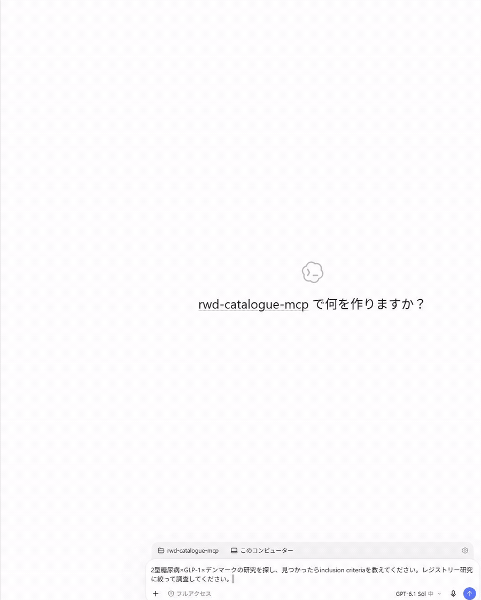

# EMA RWE MCP

**バージョン 0.5.5**。EMA Catalogueで **Non-interventional study** と明示された研究を検索し、Study documentsの最新プロトコルPDFから、研究デザイン・疾患定義・データソースを出典付きで抽出・比較するPython MCPサーバーです。根拠にはPDFの物理ページ番号と逐語引用を付けます。検索はローカルSQLite FTSと保存済み解析を使い、PDF取得は絞り込んだ研究に限ります。

開発者（このMCP自体を改修する人）向けの情報は [README_DEV.md](README_DEV.md) にまとめています。

## Codex Appでの操作イメージ



[録画をMP4で見る](docs/media/codex-ema-rwe-demo.mp4)（約64秒。待機部分を短縮）

新規チャットに「2型糖尿病×GLP-1×デンマークの研究を探し、見つかったらinclusion criteriaを教えてください。レジストリー研究に絞って調査してください。」と入力した実際の操作を録画しています。ema-rwe MCPで候補数を確認し、プロトコルから出典ページ付きで組入れ基準を調べます。候補数は収録済みローカル索引の一致数で、カタログのデータソース種別`registry`による絞り込みです。

## 導入

uvがあれば、cloneせずにMCPクライアントへ登録できます。カタログDBとEMA医薬品辞書はパッケージに同梱され、初回起動時にOSのユーザーデータディレクトリへ複製されます。新しい版がより新しいカタログDBを同梱していれば、起動時にカタログだけを差し替えます（保存済みの解析結果は残ります。`EMA_DB_PATH`で別のDBを指定した場合は差し替えません）。

```json
{
  "mcpServers": {
    "ema-rwe": {
      "command": "uvx",
      "args": ["--from", "git+https://github.com/parfait0707/ema-rwe-mcp", "ema-rwe-mcp"]
    }
  }
}
```

[`.mcp.json.sample`](.mcp.json.sample)には、この内容を版`v0.5.5`に固定した形を置いています。版を固定するには `git+https://github.com/parfait0707/ema-rwe-mcp@v0.5.5` のようにタグを付けてください。

**必要なもの**: [uv](https://docs.astral.sh/uv/) と git。Python 3.12 は uv が自動で用意します。初回起動時にパッケージのビルドと同梱データ（約50 MB）の複製が走るため、数十秒かかることがあります。追加のAPIキーは不要です（サーバー側抽出を使う場合のみ、後述の`LLM_*`を設定します）。

### Claude Codeで使う

`.mcp.json.sample`をプロジェクト直下へ`.mcp.json`としてコピーするだけで登録されます。Claude Codeをそのディレクトリで起動し、プロジェクトMCPの初回確認に応答した後、`/mcp`で接続を確認してください。

### Codexで使う

[`.codex/config.toml.sample`](.codex/config.toml.sample)をプロジェクト直下へ`.codex/config.toml`としてコピーするだけで登録されます（先頭の「Public installation」ブロックがそのまま使えます）。Codexでプロジェクトを開き直し、`/mcp`で`ema-rwe`があることを確認します。このMCP自体を開発する場合の設定は[Codex設定ガイド](docs/codex-setup.md)を参照してください。

## 質問の仕方と流れ

日本語で、対象疾患・薬剤・知りたい定義を指定してください。国やデータソース種別が決まっていれば、あわせて指定できます。

1. 呼出元（Codex／Claude Code）が疾患名を英語名・言い換え・コード候補へ展開します。疾患辞書は同梱せず、ICD-10を語彙の手がかりにします。薬剤は英語の一般名・製品名へ翻訳し、EMA医薬品辞書とカタログの記載で展開します。配合剤の全成分を保ち、単剤とは区別します。
2. `compare_protocols`で全検索式の候補を重複除去して数えます。概念内はOR、疾患と薬剤など概念間はANDです。`role`は候補の順位付けに使い、対象疾患・曝露・アウトカムでの使用はPDFで確認します。
3. 候補が一次判定上限（既定5件）を超えると、件数の内訳を示して**データソース種別（claims/ehr/registry/others）と研究国の両方**を尋ねます。一覧が提示されていれば、上限以内の研究IDを選ぶこともできます。
4. 上限以内の全候補について最新プロトコルを取得・解析し、質問への回答を保存します。比較表の上限も既定5件で、超過時は掲載する研究をユーザーが選びます。
5. PDFの物理ページ番号・逐語引用付きの比較表とJSONを出力します。プロトコル未掲載、解析失敗、未確認事項も残します。

検索候補が0件ならPDFを取得せず、類縁概念と件数を提示し、同意後に検索を広げます。国・種別の指定で0件になった場合は、その条件の緩和を提案します。検索候補数はローカル索引の一致件数で、EMA全体の網羅数やPDF確認後の適格件数ではありません。

検索語の詳細は[展開と順位付け](docs/search-logic.md)、ツールの実行手順は[呼出元向け手順書](docs/mcp-workflow.md)を参照してください。

## ユースケースとMCP実行時間

4例とも、Codex Appの呼出元モデルに **GPT-6.1 Sol（reasoning effort = medium）** を使用しました。

2026-10-09にCodex Appから、追加APIキーなしの呼出元抽出で次の4例を実行しました。カタログは2026-10-01のスナップショット（非介入研究3,314件）です。

ここでは **MCP実行時間 = 各ケースの検索開始からPDF解析・比較JSON/Markdown出力までの経過時間 − 絞り込み質問の待機時間** と定義します。ミリ秒単位の記録を差し引いてから、秒へ四捨五入しています。

| 質問 | 絞り込み | 初期候補 → 一次判定／解析PDF | MCP実行時間 |
|---|---|---:|---:|
| 2型糖尿病×GLP-1×デンマークの研究のinclusion criteria | registry・デンマーク | 7 → 4／3 | **16分57秒** |
| COPD患者のtiotropium非介入研究のexclusion criteria | 韓国・研究ID 48428 | 39 → 1／1 | **2分04秒** |
| PAH患者研究の疾患定義に使うコード・時間条件 | claims・ドイツ | 30 → 3／3 | **7分22秒** |
| PAH患者の実態調査に使われたstudy design | claims・ドイツ | 28 → 3／3 | **7分40秒** |

出力例として、次の内容をPDFから確認しました。

- **T2DM・GLP-1**：EXCEED、semaglutide研究、FINEGUSTの組入基準。年齢、事前観察期間、新規使用、T2DMやCKDの条件を区別して抽出。残る1件はプロトコル未掲載でした。
- **COPD・tiotropium**：韓国のtiotropium＋olodaterol配合剤研究で、過敏症・喘息・他試験参加などの除外基準。指定IDのcatalogue分類はregistryで、「others」という指定より研究IDの選択を優先しました。
- **PAHの定義**：成人研究のICD-10 I27.0／I27.2とRHC・薬剤・他PH群除外の組合せ、小児研究のSNOMEDベースのOMOP concept ID集合と事前観察・既往除外条件。
- **PAHの実態調査**：成人の後ろ向き縦断コホートと、小児の集団ベースの記述的コホート。PAHが安全性アウトカムとして現れるTAPESTRYは、PAH患者を組み入れる研究としては不適格でした。

質問待機中にも別ケースの作業を進め、ケース3・4は同じPDF解析を共有しました。上記のMCP実行時間には呼出元LLMの読解・ツール操作・再試行と別ケースの作業を含みます。単回の利用実測で、サーバー内のツール実行時間だけを計測した値ではありません。費用と応答の描画時間は未計測です。[計測条件・時刻・算式](docs/benchmarks/20261009-codex-app.md)を参照してください。

## 検索ロジック

検索はローカルSQLite FTSと保存済み解析を使います。複数語は近傍一致（FTS5 NEAR）で検索し、固有語・役割の列・プロトコル所在などで順位付けします。プロトコル未掲載やテキスト層のない研究も候補から削除しません。

薬剤のクラスは所属薬へ展開しますが、クラスと個々の薬は同一視しません。展開語は`medicine_expansion`、名前の不一致で省いた所属薬は`omitted_members`で確認できます。詳細は[展開と順位付け](docs/search-logic.md)を参照してください。

## 結果の読み方

- **「計画中（planned）」と「使用済み（used）」は区別されます。** プロトコルは計画書なので、`usage`は`used`/`planned`/`candidate`/`unclear`のいずれかです。計画書に使用予定と書かれたデータソースを、実際に使用したとは断定しません。
- **どの語で見つかった研究かが分かります。** 各候補には`match_basis`（`concept`＝依頼した概念そのもの／`analogous`＝類縁概念）、`matched_terms`（一致した語）、`matched_term_sources`（語の出所：呼出元が生成した語、利用者の辞書、EMA医薬品辞書など）が付きます。類縁概念で見つかった研究の定義は、依頼した概念の定義ではありません。
- **`observed_exposures`は補完した医薬品です。** カタログの値ではなく、出所（`protocol_pass_table`＝PASS情報表、ページ付き／`catalogue_text`＝題名などの文章）を示します。`term`が薬の名前でなくクラス名やATCコードのこともあります。その研究で曝露として使われたかは、プロトコルで確かめてください。
- **呼出元が生成した英語名やICD-10コードは検証されていない検索ヒントです。** 研究で実際に使われたコードや定義は、PDFの引用で確認してください。
- **候補数はローカル索引の一致件数です。** EMA全体の件数でも、未取得PDFの本文まで検索した結果でもありません。
- **`data_source_types`（カタログ由来）と`protocol_source_assessments`（PDF由来）は別物です。** 前者はEMA検索画面でclaims/ehr/registryを限定してexportしたCSVから付与した種別タグ、後者はプロトコル本文を読んで判定した根拠付きのデータタイプです。両者が一致しない場合は`catalogue_protocol_disjoint=true`が付きますが、これは意味の誤りを断定するものではなく、差異の確認用です。
- **`missing_information`は「わからなかったこと」を明示する欄です。** 本文にヒットがないことは「記載がない」ことの証明ではないため、調査範囲と理由がここに残ります。

## 2つの動作モード

| モード | 読解と設定 |
|---|---|
| **呼出元抽出（既定）** | Codex／Claude CodeがPDF本文を読み、MCPの`cache_*`で引用検証・保存します。追加のAPIキーは不要ですが、呼出元側の契約・利用量を消費します。 |
| **サーバー側抽出** | `LLM_MODEL`と、`LLM_BACKEND=litellm`または`LLM_BASE_URL`を設定すると、MCPが指定先LLMで抽出します。認証方式に応じた資格情報と、設定先の利用料が必要です。 |

保存スキーマと引用検証は共通です。処理時間・費用・回答品質はモデル、PDF、読み方、キャッシュ状態に依存します。今回の4例は呼出元抽出のみで、両モードを比較した計測ではありません。サーバー側抽出の設定例は[開発ガイド](README_DEV.md#内部litellm経路の設定例)、過去の比較実測は[検証記録](docs/validation.md)にあります。

ユーザーが触る主な環境変数は次のとおりです（全一覧は[README_DEV.md](README_DEV.md)）。

| 環境変数 | 既定値 | 内容 |
|---|---:|---|
| `EMA_MAX_SCREENING_STUDIES` | 5 | PDF取得・全件解析に進める最大研究数 |
| `EMA_MAX_COMPARISON_STUDIES` | 5 | 比較表へ掲載する最大研究数 |
| `LLM_BACKEND` | `compatible` | `compatible`（`LLM_BASE_URL`のOpenAI互換エンドポイント）または`litellm`。`LLM_MODEL`と、`litellm`または`LLM_BASE_URL`の設定が必要 |
| `LLM_MODEL` / `LLM_BASE_URL` / `LLM_API_KEY` | (空) | 接続先LLMの指定 |
| `LLM_REASONING_EFFORT` / `LLM_MAX_TOKENS` | (空) / `0` | reasoningモデルの強度・出力上限 |
| `EMA_PROTOCOL_DIR` | DBと同じ親フォルダ内の`protocols` | 取得したPDFの保存先 |
| `EMA_TERMINOLOGY_PATH` | (空。データフォルダ内`dictionaries/*.json`があれば読む) | 独自の言い換え・マスターの辞書（任意、書式は`data/terminology.example.json`） |

## カタログの更新（任意）

同梱DBは**2026-10-01の公式CSV export**から作成した非介入研究3,314件です（claims 819件、ehr 916件、registry 559件、タグなし＝others 1,511件。種別は重複します）。新しい版がより新しいDBを同梱している場合、既定の保存先では起動時にカタログを更新し、保存済み解析・回答を保持します。`EMA_DB_PATH`で指定したDBは自動更新の対象外です。

最新の研究を加えたい場合は、[EMA検索ページ](https://catalogues.ema.europa.eu/search?f%5B0%5D=content_type%3Adarwin_study)のExport Resultsで公式CSVを取得し、`import_catalogue_csv`で取り込みます。検索前に`catalogue_status`で鮮度と種別exportの有無を確認してください。CSV未取込、または期限切れの索引で候補0件の場合には、呼出元がPlaywright MCPの表示ブラウザで公式exportを1回行う経路もあります。ファイル名と取込手順は[開発ガイド](README_DEV.md#カタログ取込の内部仕様)を参照してください。

## できないこと・注意

- **EMAサイトの検索結果ページを自動クロールしません。** `/search/`配下はrobots.txtで禁止されており、CSVはユーザー起点の表示ブラウザ操作でのみ取得します。
- **検索の中でPDFを取得するのは、一次判定上限以内になった研究だけです。** サイト全体のPDFを収集する処理ではありません。
- **医薬品欄の補完は別コマンドです。** 利用者が`uv run ema-rwe backfill-protocols`を実行した場合だけ、医薬品欄が空でプロトコル所在がある研究のPDFを1件ずつ取得します。研究間は既定60秒、429や通信障害で停止・再開でき、検索中には動きません。補完値の出所と更新規則は[開発ガイド](README_DEV.md#カタログ取込の内部仕様)を参照してください。
- 取得したPDFは`EMA_PROTOCOL_DIR`（既定はDBと同じ親フォルダ内の`protocols`）にID付きで保存され、ユーザーが削除するまで保持されます。英語以外のプロトコルの見出しの英訳は、検索用のDBに保存されます（以前の版がPDFの隣に置いた`.headings`は一度だけ取り込みます）。
- **英語以外のプロトコルは、抽出の前に見出しを英訳します。** 節の役割（背景・参考文献・方法など）は英語の見出しの語で判定するためです。既定のモードでは呼出元が英訳し（`analyze_protocol`が`needs_heading_translation`と見出しの一覧を返します）、サーバー側抽出では設定先のLLMが英訳します。英訳は節の役割の判定だけに使い、本文の読解には使いません。英訳でも役割の分からない節は読みます。そのため、英語以外のプロトコルは英語のものより読む量が多くなります。
- **プロトコルは「最新版」を自動選択します。** Study documentsの「Updated protocol」欄の文書を、それ以外のプロトコル欄の文書より優先し、同じ分類内は版番号・文書日付・公開日で選びます。判断根拠は結果の`selection_reason`に残ります。取得結果は30日間キャッシュされるため、最新性が重要な調査では`get_protocol`・`get_study`に`refresh=true`を指定してください（`analyze_protocol`の`force_refresh=true`は、保存済みの解析も捨てて読み直します）。
- 医薬品辞書（商品名⇄INN/common name⇄ATC）が古い場合は`refresh_drug_dictionary`で更新できます。
- 疾患名の英訳・類義語・類縁概念は呼出元LLMの知識に依存するため、同じ質問でも実行ごとに候補数が変わることがあります。安定させたい場合は、独自の辞書を`data/dictionaries/`に置いてください。
- サーバー側抽出を使う場合、選択したプロトコルの関連本文と質問文が設定先のLLMプロバイダへ送信されます。追加APIキーなしのモードでも、PDF本文は呼出元（Claude Code/Codex）の提供元へ送られます。

## データの出所とプライバシー

- カタログのスナップショットは [HMA-EMA Catalogues of real-world data sources and studies](https://catalogues.ema.europa.eu/)（accessed October 2026）の公式CSV export（2026-10-01）から作成しています。出典：European Medicines Agency（© EMA）。連絡先の列は取り込まず、索引にも含めていません。
- 研究の登録内容は製薬企業・研究者・機関が入力したもので、第三者が著作権を持つ場合があります。再利用には[カタログのLegal notice](https://catalogues.ema.europa.eu/legal-notice)と[EMAのLegal notice](https://www.ema.europa.eu/en/about-us/about-website/legal-notice)が適用されます。
- 医薬品辞書はEMA公式の医薬品データです。独自の疾患・薬剤の言い換えは`data/dictionaries/`のJSON辞書で追加できます（書式は`data/terminology.example.json`）。
- プロトコルPDFは選択した研究についてのみ、間隔制御・robots確認付きでEMAサイトから取得し、あなたのPCに保存されます。本文はLLM（呼出元のClaude Code/Codex、または設定したサーバー側プロバイダ）へ送信されます。
- このツールは研究デザインの参考情報を出典付きで整理するもので、出典の確認なしに研究設計へ転用しないでください。

## 不具合報告

[GitHub Issues](https://github.com/parfait0707/ema-rwe-mcp/issues) へ、質問文・研究ID・`missing_information`の内容を添えて報告してください。ライセンスは [MIT](LICENSE) で、ソースコードだけに適用されます。同梱のEMAデータ（`data/ema.sqlite3`、`data/ema-medicines.json`）とテスト用の断片には適用されず、出典と条件を[NOTICE](NOTICE)に記載しています。

## 詳細ドキュメント

- [docs/mcp-workflow.md](docs/mcp-workflow.md): 呼出元エージェントが従う手順の正本（英語。読み手はツールを操作する呼出元のモデル。MCPリソース`ema-rwe://docs/mcp-workflow`としても返すので、`uvx`で導入した環境でも呼出元が読めます）
- [docs/search-logic.md](docs/search-logic.md): 検索語の展開・医薬品照合・順位付け
- [docs/clinical-search.md](docs/clinical-search.md): 日本語疾患名・薬剤名から英語・医療コードへの展開
- [docs/comparisons.md](docs/comparisons.md): 複数プロトコルの比較・絞込の詳細
- [docs/source-types.md](docs/source-types.md): PDF由来データタイプの判定・優先順位

このMCP自体を開発・改修する場合は[README_DEV.md](README_DEV.md)を参照してください。
