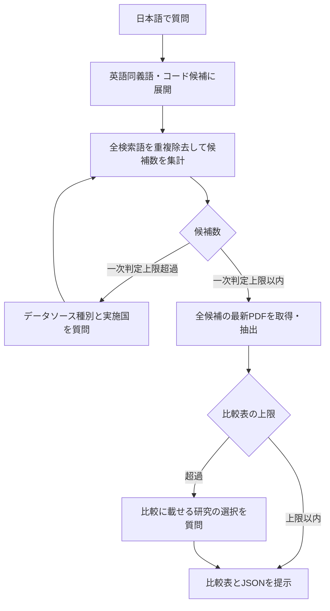

# EMA RWE MCP

**バージョン 0.1.1**。EMA Catalogueの **Non-interventional study**（介入を伴わない研究として明示的に分類された研究のみ）を検索し、Study documentsの最新プロトコルPDFから、研究デザイン・疾患定義・データソースを出典付き（PDFの物理ページ番号・逐語引用）で抽出・比較するPython MCPサーバーです。検索はローカルSQLite FTSと保存済み解析だけで行い、PDFの取得は選択した研究に限られます。EMAサイトの検索結果ページを無制限にクロールする仕組みではありません。

開発者（このMCP自体を改修する人）向けの情報は [README_DEV.md](README_DEV.md) にまとめています。

## 導入

uvがあれば、cloneせずにMCPクライアントへ登録できます。カタログDBとEMA医薬品辞書はパッケージに同梱され、初回起動時にOSのユーザーデータディレクトリへ複製されます。

```json
{
  "mcpServers": {
    "ema-rwe": {
      "command": "uvx",
      "args": ["--from", "git+https://github.com/parfait0707/rwd-catalogue-mcp", "ema-rwe-mcp"]
    }
  }
}
```

同じ内容を[`.mcp.json.sample`](.mcp.json.sample)に置いています。版を固定するには `git+https://github.com/parfait0707/rwd-catalogue-mcp@v0.1.1` のようにタグを付けてください。

**必要なもの**: [uv](https://docs.astral.sh/uv/) と git。Python 3.12 は uv が自動で用意します。初回起動時にパッケージのビルドと同梱データ（約50 MB）の複製が走るため、数十秒かかることがあります。追加のAPIキーは不要です（サーバー側抽出を使う場合のみ、後述の`LLM_*`を設定します）。

### Claude Codeで使う

`.mcp.json.sample`をプロジェクト直下へ`.mcp.json`としてコピーするだけで登録されます。Claude Codeをそのディレクトリで起動し、プロジェクトMCPの初回確認に応答した後、`/mcp`で接続を確認してください。

### Codexで使う

[`.codex/config.toml.sample`](.codex/config.toml.sample)をプロジェクト直下へ`.codex/config.toml`としてコピーするだけで登録されます（先頭の「Public installation」ブロックがそのまま使えます）。Codexでプロジェクトを開き直し、`/mcp`で`ema-rwe`があることを確認します。このMCP自体を開発する場合の設定は[Codex設定ガイド](docs/codex-setup.md)を参照してください。

## 質問の仕方と流れ

日本語のまま質問できます。呼出元（Claude Code/Codex）が疾患名・薬剤名を英語同義語やICD-10/ATCコード候補へ展開し、`compare_protocols`が全検索式の候補を重複除去して数えます。一次判定上限（`EMA_MAX_SCREENING_STUDIES`、既定5件）を超えると、MCPは**データソース種別（claims/ehr/registry/others）と実施国の両方**を、候補件数（facets）を示しながらユーザーに尋ねます。研究デザインや疾患条件でさらに絞ることもできます。一次判定上限以内になった研究は全件のPDFを取得・解析し、`EMA_MAX_COMPARISON_STUDIES`（既定5件）を超える場合は比較表に載せる研究をユーザーに選んでもらいます。



結果には根拠として、PDFの物理ページ番号と短い逐語引用が付きます。

## 結果の読み方

- **「計画中（planned）」と「使用済み（used）」は区別されます。** プロトコルは計画書なので、`usage`は`used`/`planned`/`candidate`/`unclear`のいずれかです。計画書に使用予定と書かれたデータソースを、実際に使用したとは断定しません。
- **候補数はローカル索引の一致件数です。** EMA全体の件数でも、未取得PDFの本文まで検索した結果でもありません。
- **`data_source_types`（カタログ由来）と`protocol_source_assessments`（PDF由来）は別物です。** 前者はEMA検索画面でclaims/ehr/registryを限定してexportしたCSVから付与した種別タグ、後者はプロトコル本文を読んで判定した根拠付きのデータタイプです。両者が一致しない場合は`catalogue_protocol_disjoint=true`が付きますが、これは意味の誤りを断定するものではなく、差異の確認用です。
- **`missing_information`は「わからなかったこと」を明示する欄です。** 本文にヒットがないことは「記載がない」ことの証明ではないため、調査範囲と理由がここに残ります。

## 2つの動作モード

追加のAPIキーなしでも使えますが、コストとスピードを重視する場合はサーバー側抽出を設定できます。ユーザーが選ぶものです。

| モード | 内容 |
|---|---|
| **追加APIキーなし（既定）** | 呼出元（Claude Code/Codex）自身がPDF本文を読んで抽出します。PDF本文が会話コンテキストに積まれるため費用が高くなります（242頁のプロトコルで1問あたり100 turn超・$20超）。Claude Codeでは、MCPの案内に従って研究ごとの読み取りをSonnetサブエージェントへ委譲する運用にしています。 |
| **サーバー側抽出** | `.env`またはMCPの`env`に`LLM_BACKEND=litellm`、`LLM_MODEL`、`LLM_BASE_URL`、`LLM_API_KEY`、`LLM_REASONING_EFFORT`、`LLM_MAX_TOKENS`を設定すると、MCPプロセス自身が設定先LLMでPDFを抽出します。Azure OpenAIのv1エンドポイントを使う場合は`LLM_MODEL=openai/<deployment>`とします。 |

**大きめのプロトコル（100頁超）を複数比較する場合は、サーバー側抽出の設定を推奨します。** PDF本文を呼出元の会話コンテキストへ積まないため、同じ質問でも所要時間・コストの両方が下がります。

| 質問 | モード | 壁時計 | コスト（Claude側） |
|---|---|---:|---:|
| q1: 日本のレセプトでの膵炎アウトカム定義 | サーバー側抽出（Azure OpenAI, gpt-5.6, effort=high） | 17分 | $4.00 |
| q1: 同上 | 追加APIキーなし（Sonnetサブエージェントへ委譲） | 28分 | $22.04 |
| q2: 心不全患者コホート定義 | サーバー側抽出（同上） | 18分 | $5.05 |
| q2: 同上 | 追加APIキーなし（Sonnetサブエージェントへ委譲） | 32分 | $24.22 |

実測はheadless Claude Codeでの各質問1回の実行（詳細と実行条件は[docs/validation.md](docs/validation.md)の2026-09-25の記録）。盲検採点では両モードの抽出品質は同程度〜僅差で、優劣は一定していません。この差は主に「PDF本文をどちらが読むか」によるコストとスピードの差であり、精度面でサーバー側抽出が優れていることを意味しません。

ユーザーが触る主な環境変数は次のとおりです（全一覧は[README_DEV.md](README_DEV.md)）。

| 環境変数 | 既定値 | 内容 |
|---|---:|---|
| `EMA_MAX_SCREENING_STUDIES` | 5 | PDF取得・全件解析に進める最大研究数 |
| `EMA_MAX_COMPARISON_STUDIES` | 5 | 比較表へ掲載する最大研究数 |
| `LLM_BACKEND` | `compatible` | サーバー側抽出を使うなら`litellm` |
| `LLM_MODEL` / `LLM_BASE_URL` / `LLM_API_KEY` | (空) | 接続先LLMの指定 |
| `LLM_REASONING_EFFORT` / `LLM_MAX_TOKENS` | (空) / `0` | reasoningモデルの強度・出力上限 |
| `EMA_PROTOCOL_DIR` | DBと同じ親フォルダ内の`protocols` | 取得したPDFの保存先 |

## カタログの更新（任意）

同梱のカタログDBは**2026-09-13時点**のNon-interventional study全件です。最新の研究を検索対象に加えたい場合だけ、[EMA検索ページ](https://catalogues.ema.europa.eu/search?f%5B0%5D=content_type%3Adarwin_study)のExport ResultsでCSVを取得し、`import_catalogue_csv`で取り込みます。CSVを一度も取り込んでいない、または最新取込から`EMA_CATALOGUE_TTL_SECONDS`（既定30日）を過ぎて検索候補が0件だった場合は、Playwright MCPを併用して呼出元が表示ブラウザでEMA公式のExportを1回実行し、そのCSVを取り込む経路も使えます。手順の詳細（必須列・ファイル名規約・Playwright併用の理由）は[README_DEV.md](README_DEV.md)を参照してください。

## できないこと・注意

- **EMAサイトの検索結果ページを自動クロールしません。** `/search/`配下はrobots.txtで禁止されており、CSVはユーザー起点の表示ブラウザ操作でのみ取得します。
- **PDFは一次判定上限以内になった研究のものだけを取得します。** サイト全体のPDFを収集する処理ではありません。
- 取得したPDFは`EMA_PROTOCOL_DIR`（既定はDBと同じ親フォルダ内の`protocols`）にID付きで保存され、ユーザーが削除するまで保持されます。
- **プロトコルは「最新版」を自動選択します。** Updated protocol > Protocol > Initial protocolの順で、同じ分類内は版番号・文書日付・公開日で選びます。判断根拠は結果の`selection_reason`に残ります。取得結果は30日間キャッシュされるため、最新性が重要な調査では`force_refresh=true`を指定してください。
- 医薬品辞書（商品名⇄INN/common name⇄ATC）が古い場合は`refresh_drug_dictionary`で更新できます。
- サーバー側抽出を使う場合、選択したプロトコルの関連本文と質問文が設定先のLLMプロバイダへ送信されます。追加APIキーなしのモードでも、PDF本文は呼出元（Claude Code/Codex）の提供元へ送られます。

## データの出所とプライバシー

- カタログのスナップショットは [EMA Catalogues of RWD studies](https://catalogues.ema.europa.eu/) の公式CSV export（2026-09-13）から作成しています。連絡先の列は取り込まず、索引にも含めていません。研究情報の利用条件はEMAサイトの規約に従ってください。
- 医薬品辞書はEMA公式の医薬品データです（`data/`）。疾患名の辞書は同梱せず、日本語の質問はMCPクライアント（Claude Code、Codex等）がICD-10を手がかりに英語名・言い換え・コード候補へ翻訳します。独自の言い換えやマスターを使う場合は`data/dictionaries/`にJSON辞書を置きます（書式は`data/terminology.example.json`）。
- プロトコルPDFは選択した研究についてのみ、間隔制御・robots確認付きでEMAサイトから取得し、あなたのPCに保存されます。本文はLLM（呼出元のClaude Code/Codex、または設定したサーバー側プロバイダ）へ送信されます。
- このツールは研究デザインの参考情報を出典付きで整理するもので、出典の確認なしに研究設計へ転用しないでください。

## 不具合報告

[GitHub Issues](https://github.com/parfait0707/rwd-catalogue-mcp/issues) へ、質問文・研究ID・`missing_information`の内容を添えて報告してください。ライセンスは [MIT](LICENSE) です。

## 詳細ドキュメント

- [docs/mcp-workflow.md](docs/mcp-workflow.md): 呼出元エージェントが従う手順の正本
- [docs/clinical-search.md](docs/clinical-search.md): 日本語疾患名・薬剤名から英語・医療コードへの展開
- [docs/comparisons.md](docs/comparisons.md): 複数プロトコルの比較・絞込の詳細
- [docs/source-types.md](docs/source-types.md): PDF由来データタイプの判定・優先順位

このMCP自体を開発・改修する場合は[README_DEV.md](README_DEV.md)を参照してください。
