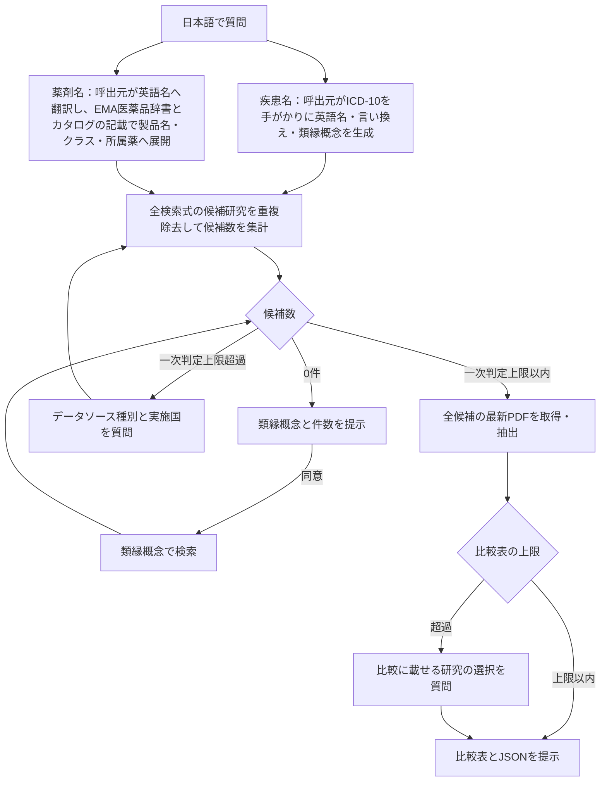
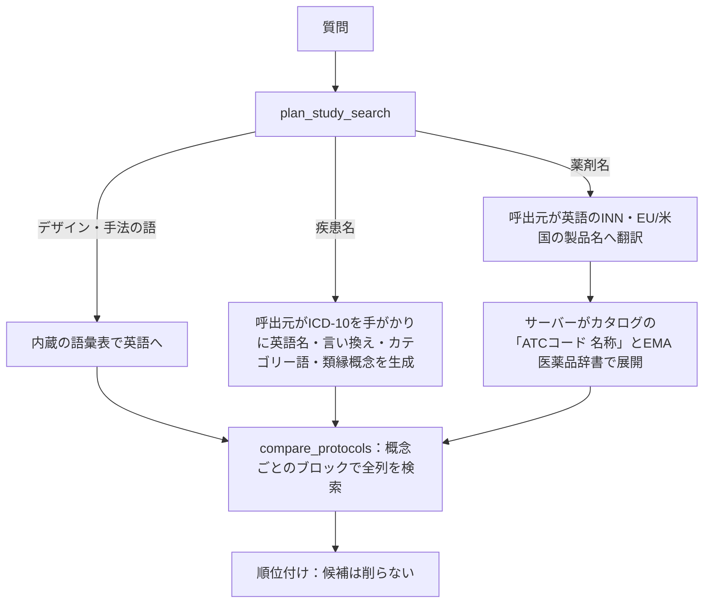

# EMA RWE MCP — 開発者向け

エンドユーザー（このMCPを使って研究を調べる人）向けの使い方は[README.md](README.md)を参照してください。本ファイルはこのMCPサーバー自体を開発・改修する人向けの内部仕様です。

公開版は0.5.5（内部履歴では0.1〜1.10の仕様段階を経ている）。`docs/spec/v0.1.md`〜`v1.10.md`が仕様の正本、[docs/mcp-workflow.md](docs/mcp-workflow.md)が呼出元向け手順の正本、開発ルールは[AGENTS.md](AGENTS.md)です。

## 開発用セットアップ（checkout）

Python 3.12以上とuvを使います。

```powershell
uv venv --python 3.12
uv sync --extra dev
$env:EMA_DB_PATH = "<checkout>/data/ema.sqlite3"
$env:EMA_CACHE_DIR = "<checkout>/cache/http"
$env:EMA_IMPORT_DIR = "<checkout>/data/imports"
uv run ema-rwe --help
```

内部LLM経路も試す場合は`uv sync --extra dev --extra llm`とします。別の場所にcloneした場合はパスを置き換えてください。CLIは各OSで`uv run ema-rwe`から実行します。

`EMA_DB_PATH`未設定時は、`config.py`の`default_data_dir()`がチェックアウト内（`pyproject.toml`がある場所）かどうかを判定し、チェックアウト内なら`<repo>/data/ema.sqlite3`（Git管理のカタログDB）を、そうでなければOSのユーザーデータディレクトリ（初回のみ同梱データを複製）を使います。キャッシュは`EMA_CACHE_DIR`未設定時にOSのユーザーキャッシュディレクトリが既定です。`.env.example`は設定例のドキュメントであり、**このリポジトリは`.env`を自動読込しません**（`python-dotenv`等は使用していません）。環境変数はシェルまたはMCPクライアントの`env`で渡してください。

## レイアウト

`src/ema_rwe/`配下で、Core・CLI・MCPアダプタを分離しています。

| モジュール | 役割 |
|---|---|
| `service.py` / `cli.py` / `mcp/server.py` | 共通処理、CLI、stdio MCPの18ツール |
| `storage.py` / `archive.py` | SQLite永続化、CSV取込、解析・読み方の履歴、不変ID付きPDFの保持 |
| `pdf.py` / `domain.py` | PDF構造・節の役割・引用検証、抽出スキーマと例外型 |
| `llm.py` / `exploration.py` | サーバー側抽出、見出し英訳、質問別探索・回答保存 |
| `terminology.py` / `vocabulary.py` | 利用者辞書、コード表記、研究デザイン・手法の語彙 |
| `drugs.py` / `medicines.py` | EMA医薬品辞書、成分・製品・クラスの展開、医薬品欄の補完 |
| `selection.py` / `ranking.py` / `source_types.py` | 絞り込み、候補順位、PDF由来データタイプの評価 |
| `comparison.py` | 全screening研究のPDF/JSON/Markdown出力。失敗・未完了を保持 |
| `ema.py` / `http.py` | Study documentsの解析・最新版選択、robots・間隔・リトライ制御 |
| `config.py` / `snapshot.py` | 環境設定・同梱データ更新、月次スナップショットの作成・検証 |

検索・医薬品照合の詳細は[展開と順位付け](docs/search-logic.md)、保存・抽出の変更時は関連仕様と以下の節を確認してください。

## データ処理の流れ

質問の展開から候補の絞り込み、PDF解析、比較出力までの全体像です。候補数は全検索式で見つかった研究の重複除外unionで数え、一次判定上限と比較表の上限を別々に扱います。PDF未掲載・取得失敗・未確認事項も出力に残します。



## 内部の探索ロジック

検索語を作る呼出元と、語の展開・ローカル検索・順位付けを行うサーバーの役割を示します。検索対象はカタログのメタデータで、各研究のコードや定義は候補選択後にPDFの引用で確認します。



概念間はAND、同じ概念の検索variant間はORです。`compare_protocols`の`role`は役割に対応する列での一致を順位へ反映し、検索対象をその列だけに限定しません。疾患・薬剤ごとの展開規則と順位の詳細は[展開と順位付け](docs/search-logic.md)を参照してください。

## テスト・lint・ビルド

```bash
uv run pytest -q
uv run ruff check src tests
uv run ruff format --check src tests
uv build
```

通常テストはネット通信せず、固定HTML断片・合成PDF・`MockTransport`を使用します。CSV取込・検索・対象外排除・新版選択・PDF抽出・引用検証・解析保存・再検索・差し替え検出・HTTPリトライ・期限切れ削除に加え、**MCP stdio初期化／discovery／実行／入力エラーの実stdio MCPテスト**を含みます。ツールのスキーマを変更した場合は必ずこれらを実行してください。依存関係は`uv.lock`に固定しています。検証結果と未実施の確認は[docs/validation.md](docs/validation.md)に記録してください。

## 配布

wheelにはカタログDB、EMA医薬品辞書、呼出元手順書を同梱します。チェックアウト外では初回起動時にOSのユーザーデータディレクトリへ複製します。手順書はMCPリソース`ema-rwe://docs/mcp-workflow`からも取得できます。

既定DBの更新は`storage.refresh_from_bundle`で、1プロセスにつき1回確認します。

- 同梱DBの取込日時が新しければカタログの表だけをトランザクションで更新します。同じスキーマ版でなければ更新せず、利用者のCSVが新しい場合も保持します。
- PDF由来の事実は`protocol_observations`に分離して保持します。手元にない項目を補い、医薬品の補完値は出所ごとに`EXPOSURE_RULES`の版が新しい場合だけ置き換えます。
- 解析・回答・見出しの読み方は保持します。`get_study`で更新したカタログ行は同梱値へ戻り得ますが、PDF観測は保持します。
- `EMA_DB_PATH`で指定したDBは自動更新・統合の対象外です。医薬品辞書は`refresh_drug_dictionary`で更新します。更新失敗時は元のカタログで起動します。

`.mcp.json`（このリポジトリ直下、Git管理外）は各自の登録で、開発中は`uv run --directory /path/to/repo ema-rwe-mcp`によりチェックアウトを直接起動できます（作業ツリーの未コミット変更もそのまま反映されます）。公開版を確かめるときは`.mcp.json.sample`と同じ`uvx`の形にします。`.mcp.json.sample`（Git管理対象）はエンドユーザー向けで、`uvx --from git+https://...`によりcloneなしでリモートのコードを取得・起動します。両者は起動対象（ローカル作業ツリー vs. リモートのgit ref）が異なる点に注意してください。

リポジトリを公開する場合は次を行います。

1. `.gitignore`を再確認する（現状は`data/`配下のうちカタログDB・医薬品辞書・辞書の記入例・関連語の判定記録の4ファイルと`imports/`の空フォルダだけを追跡し、他はすべて除外。PDF・DB・キャッシュ・`.env`・`docs/agent_brief/`・`docs/agent_report/`も除外済み）。
2. リリースタグ（`v<pyproject.tomlの版>`）を打つ。手順は[docs/release.md](docs/release.md)。
3. 月ごとのカタログは、アプリとは別に`data-<YYYYMMDD>`のリリースとして公開する（`scripts/build_catalogue_snapshot.py`、手順は同じ文書）。サーバーはまだスナップショットを取得しないので、利用者の同梱DBの更新はアプリのリリースで行う。

PyPI公開やGitHub Releaseへのwheel添付など他の配布経路の比較検討は[docs/research/202609160750_mcp_distribution.md](docs/research/202609160750_mcp_distribution.md)を参照してください。

## カタログ取込の内部仕様

`import_catalogue_csv(filename)`は`EMA_IMPORT_DIR`（既定は`EMA_DB_PATH`と同じ`data/`配下の`imports/`）の`studies/`または`source_type/`直下のファイル名のみを受け付けます（移行用にルート直下も読みます）。任意パスは受け付けません。

- **必須列**: `Study ID`、`Official title and acronym`（公式CSVでは`Title`）、`Study type`。別名の対応は`storage.py`の`ALIASES`を参照してください。不一致はエラーになり、黙って0件登録しません。列名が異なる場合はCLIでは`--column-map ./columns.json`、MCPの`import_catalogue_csv`では`column_map`（辞書）を使います（例: `{"study_id":"Study identifier","title":"Title","study_type":"Type"}`）。
- **Non-interventional判定**: `Non-interventional study` / `Non-interventional`と明示された研究だけ取り込みます。種別不明・介入研究は除外します。URL中の`content_type:darwin_study`は研究レコード種別で、DARWIN EU研究限定とは別です（`darwin_only`は独立したフラグで判定）。
- **種別タグ（`data_source_types`）**: `Data sources (types)` / `Data source type`列があれば直接取り込みます。ただし2026-09-12/13時点のStudies exportにはこの列がないため、EMA検索画面でData source typeをclaims/EHR/registryに限定してexportしたCSVを`source_type/`へ置き、**ファイル名に埋め込んだ種別だけをタグの根拠**とします。ファイル名は`<日付>_<claims|ehr|registry>_export-data.csv`とし、種別トークンが1つだけ含まれる必要があります。日付は`YYYYMMDD_`の接頭辞で書きます（`catalogue_status`の`snapshot_aligned`と、スナップショットの作成がこの日付を読みます）。全研究のエクスポートも`<YYYYMMDD>_all_export-data.csv`のように同じ日付で始めます。種別exportを取り込む前の研究はすべて`others`として扱われます。`source_type/`のファイルは各研究の`data_source_types`に種別を追加し（複数種別は累積。名前に種別を含むファイルは他のフォルダに置いても、名前の種別で付く）、その後に全件exportを再取込してもタグは保持されます。
- **区切り**: 複数値の区切りは`|`・`;`・改行です。値内部のカンマは分割しません。
- **プロトコル所在（`protocol_listed`）**: `Protocol file(s)`・`Protocol file(s) - URI`・`Protocol URL`のいずれかに値があれば`true`、すべて空なら`false`、列が無ければ未設定です。順位付けにだけ使い、最新版の選択には使いません（最新版はStudy documentsで選びます）。
- **再構築**: `data/imports/{studies,source_type}/`にexportを置いて`uv run ema-rwe import-all`を実行すると、`studies/`、`source_type/`の順にすべて取り込み、最後に`VACUUM`でDBファイルの空き領域を詰め直します（`merge-observations`も同じ。同梱DBは、この2つのコマンドで作ります）。出力の`vacuum`に前後のファイルサイズ（`bytes_before`、`bytes_after`）が入ります。
- **医薬品欄の補完**: `uv run ema-rwe backfill-protocols [--interval 60] [--limit N] [--no-download] [--reextract]`。医薬品欄が空の研究に、題名・説明・目的の既知の医薬品名（通信なし）と、CSVにプロトコルの所在がある研究のプロトコルのPASS情報表（Active substance・Medicinal product）の既知の医薬品名・カタログのクラス名・欄に書かれたATCコード・ページを補います（spec v1.2、v1.3）。研究の略称と同じ名前、検査値として書かれた物質名、直後にreceptor・inhibitorなどが続く名前は補いません。1件ずつ、研究の間を`--interval`秒空け、429や通信障害で止まり（HTTP層の再試行の後）、読み終えた研究（`backfill_done`）は飛ばして再開します。同梱DBを作るときは、作業用のDB（`EMA_DB_PATH`）で実行してから、`EMA_DB_PATH`を外して（チェックアウトの`data/ema.sqlite3`を対象にして）`uv run ema-rwe merge-observations <作業用DB>`で同梱DBに観測を加えます（配る項目だけを移し、索引も作り直します。失敗はエラーとして返します）。抽出の規則を直したときは、作業用DBで`--reextract --no-download`を実行して保存済みのPDFから読み直し、`medicines.EXPOSURE_RULES`の該当する出所の版を上げます（同梱DBの新しい版の結果が、利用者のDBの古い結果を置き換えます）。
- **upsert**: 研究ID単位のupsertです。今回のCSVにない既存研究は削除しません。元CSVのバイト列、SHA256、ファイル名、取込時刻を保存します。
- **連絡先の非索引化**: 原本CSVに連絡先が含まれる場合があります。原本は検索対象から分離され、連絡先専用列はDB／FTS／検索結果には入れません。
- **Data Sources CSVは不要**: カタログの種別タグはローカル候補の絞り込みだけに使い、定義ごとのデータタイプは候補PDFの該当用途からLLMで判定して公式のStudy分類と分けて保存します（[docs/source-types.md](docs/source-types.md)）。
- **Playwright MCP経路の理由**: `/search/`配下はrobots.txtで明示的にDisallowされているため、このMCP自身は検索結果ページやExport URLをHTTPでクロールしません。代わりに、Microsoft公式[Playwright MCP](https://github.com/microsoft/playwright-mcp)を呼出元用の別MCPとして併用し、ユーザーが開始した調査で公式の画面手順（`Export Results`）を1回だけ実行します。ブラウザをPythonサーバーへ埋め込まず画面操作を呼出元へ分離することで、DOM変更時にLLMが要素を再探索でき、検索・検証・保存処理も単独で利用できる設計です。`EMA_CATALOGUE_TTL_SECONDS`（既定30日）以内で候補が0件の場合は、先に英訳・同義語・コード・絞込条件を見直し、同じsnapshotの再取得を避けます。

## 抽出と検証の仕組み

**読む範囲の決め方（`pdf.py`）**: PDFにしおり（ブックマーク）があれば、それを一次の目次として使います。各ページに「そのページを含む最も深いしおり」と「その最上位の章」を付け、本文の見出し検出で役割が決まらない章にはしおりの題名から役割を与えます（`apply_bookmarks`）。抽出で読む節は`reading_order`が決め、しおりがある場合はページ順に、本文の章と、付録のうち本文が参照しているもの（「Annex 3」「Appendix V」）とコードリスト・変数定義の題名を持つものだけを読みます（履歴書・ENCePPチェックリスト等は読みません）。しおりのないPDFでは、印字ページのずれを確かめた目次で節の始まりを決め、目次も無ければ本文より大きいか太字で章番号が続く行を章見出しとし、関連セクションをすべて読みます（spec v1.5）。節の役割は、読むか、引用を受理するか、抽出の指示の三つに別々に使います。質問別探索（`search_sections`）はしおりの章名に一致した語を最優先で採点します。実測では242頁のプロトコル（19786）の読取量が、しおりを使わない場合の44.8万字に対して11.1万字です（parser `structural-v24`、2026-10-06）。

**英語以外のプロトコル（spec v1.6）**: 役割の語は英語なので、本文が英語でない文書（英語の機能語が全語の8%未満）は、見出しとしおりの題名（`pdf.heading_texts`）の英訳から役割を判定します。`analyze_protocol`はPDFごとに一度だけ（parserの版が変わったら再び）言語を判定し（`service._check_heading_language`）、内部LLMがあれば`llm.translate_headings`で英訳し、無ければ`status=needs_heading_translation`と見出しの一覧を返します。呼出元は`cache_heading_translations`で英訳を保存します（`{}`なら英訳なしで読む）。判定結果と英訳は利用者のDBの`protocol_readings`表にparserの版とともに置き（`Explorer.reading_record`。以前の版がPDFの隣に置いた`<protocol_id>.headings`は一度だけ取り込む）、`extract_pages(translations=...)`が各`Page.heading_translations`に渡すので、`sections`を呼ぶ全経路（抽出・引用検証・探索ツール）が同じ役割を使います。英訳は節の役割の判定（読むか、引用を受理するか、抽出の指示）だけに使い、本文の読解には使いません。本文の手がかり語（英語）は英語でない本文を読めないので、英訳でも役割の分からない節は読みます。英訳はfingerprintに入れません（比較表が翻訳前にfingerprintを記録するため）。英訳を別の内容で保存し直すと、同じトランザクションでそのPDFの保存済み解析を失効させ、途中のバッチと実行中の抽出も取り消します。解析は抽出時の読み方（英訳のハッシュ、`source.reading`）を記録し、保存はDBの今の読み方と一致するときだけ行う（`Repository.save_analysis(reading=...)`、不一致は`READING_CONTEXT_CHANGED`）ので、DBを共有する別のサーバープロセスが英訳を変えても古い解析は保存されません（spec v1.8）。質問別回答のキャッシュの鍵には英訳を含めるので、英訳の前に保存した回答は英訳の後に再利用しません。質問別の探索は、全文の回答、最初の検索、内部LLMの`search`／`outline`／`read`、引用の検証、鍵のすべてを開始時の英訳で行います。探索ツールの応答の`source.reading`はその応答を作った読み方で、呼出元は`research_protocol`の`reading`と違えば探索をやり直します（各ツールに読み方を渡して拒否する仕組みは無いので、呼出元が見落とした探索中のA→B→Aは保存時の照合をすり抜けます。spec v1.10）。

**抽出スキーマ v0.3（`domain.py`）**: `cohort`ブロックを追加しました。`inclusion_criteria[]`・`exclusion_criteria[]`（各基準を1事実として根拠付き）、`index_date`、`baseline_period`（連続加入・ルックバック）、`follow_up`（開始・終了・打ち切り）、`design_schema`（設計図の物理ページ`figure_pages`と、本文にある対応する時間窓の記述`time_windows[]`）です。図そのものは画像のため読みません。fingerprintに`schema: 0.3`が入るため、既存の保存済み抽出は次回`analyze_protocol`で再抽出されます。比較表には「コホート定義」「設計図（ページ・時間窓）」の行が加わります。

`analyze_protocol`は2つの経路を持ちます。

**呼出元抽出**（`LLM_MODEL`が未設定、または`LLM_BACKEND=compatible`で`LLM_BASE_URL`が未設定のとき）: 英語以外のプロトコルで英訳が無ければ、先に`needs_heading_translation`を返します。それ以外は`needs_client_extraction`と関連セクション・物理PDFページ・抽出JSON Schema・fingerprintを返します。呼出元は`offset`を進めながら`analyze_protocol(offset=next_offset)`で全バッチを読み、バッチごとに`cache_protocol_analysis(batch_offset=offset)`で途中保存します（サーバーは保存済みoffsetを`cached_batch_offsets`で返すので、コンテキスト圧縮後も既読分を再読しません。途中保存はサーバープロセスのメモリにあるだけで、サーバーを再起動すると失われます。`status=extracting`の進行中の抽出も同じです）。最後のバッチで`coverage_complete=true`を渡すとサーバーが全バッチを統合して保存します。

**サーバー側抽出**（`LLM_MODEL`があり、かつ`LLM_BACKEND=litellm`または`LLM_BASE_URL`があるとき）: 関連セクションを`LLM_BATCH_CHARS`（既定300,000文字）以下のバッチに分割し、`LLM_CONCURRENCY`（既定4）並列でプロバイダに投げて統合します（`llm.py`の`split_batches`/`merge_extractions`）。抽出が`LLM_WAIT_SECONDS`（既定120秒）を超えるときは`status=extracting`を返すので、呼出元は同じ`analyze_protocol`をポーリングします。保存前に`service.py`が`pdf.finalize_extraction`を呼び、その中の`prune_unverifiable`が証拠を検証します。隣のページに引用があればページを直し、データソース名が引用に無ければ名前を含む引用を加え、それでも原文と一致しない証拠だけを落として、件数と監査メモを`missing_information`に記録します。プロンプトはLLMに`evidence.section`を`null`のまま返すよう指示し（`llm.py`）、サーバーが引用の位置から節ラベルを導出します（`pdf.py`の`with_section`）。抽出プロンプトは節ラベル省略・電報体の`value`/`definition`・JSON最小化を指示しつつ「事実・コード・条件の省略禁止」も明示しており、出力トークンを削減しながら証拠件数を落とさない設計です（実測は[docs/validation.md](docs/validation.md)の2026-09-24節を参照）。

`research_protocol`（内部LLM設定時）は、まず`exploration.py`の`answer_from_full_text`（全関連セクションを`LLM_BATCH_CHARS`バッチへ分割し、並列で1回ずつ問い合わせて統合・pruneする「全文一括回答」）を試みます。これが回答を得られなかった場合のみ、`search`/`outline`/`read`/`finish`アクションを1手ずつ選ばせるステップ制限探索ループにフォールバックします（`LLM_MAX_STEPS`既定8・上限20。到達すると`exploration_limit_reached`を返し、未完了の回答は保存しません）。全文一括回答は2026-09-24に、旧来のステップ制限ループだけの構成（12,000字の読み取りでステップ予算を使い切っていた）を置き換える形で追加されました。

引用検証の規則: 各事実には短い原文引用・PDFの物理ページ番号・セクションを付けます。引用の存在、ページ、指定セクションはコードで検証します（`pdf.py`の`validate_evidence`、`EVIDENCE_INVALID`/`EVIDENCE_WRONG_SECTION`）。研究方法・データソース欄の引用が背景・参考文献・目次・ENCePPチェックリストにしか存在しない場合は`EVIDENCE_WRONG_SECTION`で保存を拒否します（補足事項・質問別回答はその章自体への質問もあるため許容）。データソース名は引用中に存在する名前に限定します。引用が存在することは、要約や使用区分の意味が正しいことの保証ではありません。

## CSVは直接取得せず、PDFは保存できる理由

対象と取得方法が異なります。

| 項目 | 公式CSV | プロトコルPDF |
|---|---|---|
| 発見元 | `/search/`の検索結果とExport操作 | 既知のStudy IDのStudy documents |
| robotsの扱い | `/search/`配下が明示的にDisallow | Studyページ、Study documents、`/system/files/`の対象PDFは同じ禁止対象ではない |
| 取得量 | 検索母集団全体のmetadata export | 一次判定上限（既定5件）以内の研究の最新版だけ |
| MCPの取得方法 | 直接HTTP取得を行わず、ユーザー起点の表示ブラウザ操作 | 識別可能なUser-Agent、間隔制御、robots確認付きでオンデマンド取得 |
| 保存目的 | ローカル検索用snapshot。原本とchecksumを保持 | 引用再確認・追加探索・版差替え検出。Study ID＋SHA256の不変IDで保持 |

PDF保存は「サイト全体のPDFを収集する」処理ではありません。ローカル候補が一次判定上限以内になってから、その研究のStudy documentsに掲載された最新版だけを取得します。取得時にも各URLのrobots判定、EMA HTTPSホスト制限、サイズ・ページ数制限、最低2秒間隔を適用します。CSV Exportは入口が禁止対象の`/search/`配下なので、同じHTTPクライアントから自動取得しない設計です。

## 最新版の選択・キャッシュ・取得制限

- Study IDとDrupalのnode IDは別物です。Studyページの実リンクから各タブへ移動します。
- 版の優先順位は、Study documentsの「Updated protocol」欄（クラス名に`-upd`を含む欄）の文書を、それ以外のプロトコル欄の文書より上にする（`ema.py`の`KIND_RANK`）。同じ分類内は、全候補に版があれば数値版番号、なければ全候補の文書日付、最後に利用可能な公開日で選択します。タイトル中の版・日付を用い、ファイルのアップロード日時だけでは比較しません。不十分な場合は`selection_reason`に不確実性を示します。PDF本文の全版を読み比べた意味的な最新版判定は行いません。`get_protocol`は候補一覧も返します。
- HTTPのHTML/PDFレスポンスキャッシュ（`EMA_CACHE_TTL_SECONDS`）とCSV snapshotの鮮度判定（`EMA_CATALOGUE_TTL_SECONDS`）は、どちらも既定30日間（2,592,000秒）です。EMAには固定の一括更新日がなく研究所有者が随時更新し、実CSVでも直近30日間に111/3,312件が更新されていました。最新性が重要な調査ではCSV再取得と`refresh=true`（`get_study`・`get_protocol`）を使います。起動時・期限切れ再取得時・`cleanup-cache`で期限切れを削除し、停止中に時刻通り削除する常駐ジョブは作りません。取得したPDFは`EMA_PROTOCOL_DIR`にID付きで保持し、全文テキストは恒久索引化しません。
- 構造化結果は永続保存します。URL、版、PDFのSHA256、schema、parser、prompt、モデル・provider設定からfingerprintを生成し、解析時はDocuments/PDFをTTLに従い再検証して同一URLの差し替えも検出します。通常検索はネット通信しないので、最新版とは`protocol_source`に記録した確認時点のものです。
- 1プロセス内のHTTP同時数1、最小2秒間隔、タイムアウト30秒、最大3回リトライです。Retry-Afterを優先し、60秒を超える待機指定は再試行可能時刻の目安付きエラーとして返します。robots.txtを確認し、取得先／リダイレクト先はEMA CatalogueのHTTPSに限定します。
- PDFは50 MiB／1,500ページ／抽出500万文字まで。OCR・暗号化PDFは対象外です。

```powershell
uv run ema-rwe analyze 1000000479 --refresh
uv run ema-rwe cleanup-cache
```

## 抽出経路の設定条件

`LLM_MODEL`があり、`LLM_BACKEND=litellm`または`LLM_BASE_URL`が設定されている場合だけサーバー側抽出を使います。APIキーだけでは有効になりません。その他は呼出元抽出です。

共通スキーマ・引用検証・DB再利用は両経路で使いますが、探索範囲や品質はモデルと読み方に依存します。サーバー側へ渡るのは指定した質問とPDF情報で、会話履歴全体は自動転送されません。既知の条件は質問に含めてください。費用・速度の過去実測は[検証記録](docs/validation.md)、今回のCodex Appの4例は[ベンチマーク記録](docs/benchmarks/20261009-codex-app.md)を参照してください。

## 環境変数の全一覧

`config.py`の`Settings`が正本です（既定値付き）。ただし辞書のパス（`EMA_DRUG_DICTIONARY_PATH`は`drugs.py`、`EMA_TERMINOLOGY_PATH`は`terminology.py`）は`Settings`の外で読みます。

| 環境変数 | 既定値 | 内容 |
|---|---:|---|
| `EMA_DB_PATH` | チェックアウト内`data/ema.sqlite3`、それ以外はユーザーデータディレクトリ | SQLite DBのパス |
| `EMA_CACHE_DIR` | ユーザーキャッシュディレクトリの`http` | HTTPレスポンスキャッシュ |
| `EMA_REQUEST_INTERVAL_SECONDS` | `2`（最小2.0に丸め） | HTTP取得の最小間隔 |
| `EMA_HTTP_TIMEOUT_SECONDS` | `30` | HTTPタイムアウト |
| `EMA_CACHE_TTL_SECONDS` | `2592000`（30日） | HTTPレスポンス（HTML・PDF）キャッシュの期限と、`get_study`が詳細ページを再確認する間隔 |
| `EMA_CATALOGUE_TTL_SECONDS` | `2592000`（30日） | ブラウザ再取得を推奨するまでの期限 |
| `EMA_MAX_SCREENING_STUDIES` | `5`（1〜1000） | 一次判定でPDF取得・全件解析へ進める最大研究数 |
| `EMA_MAX_COMPARISON_STUDIES` | `5`（1〜1000） | 比較表へ掲載する最大研究数 |
| `EMA_MAX_LISTED_CANDIDATES` | `50`（1〜1000） | `needs_narrowing`時に`candidates`一覧を返す最大件数 |
| `EMA_USER_AGENT` | `ema-rwe-mcp/0.5.5` | EMAへのHTTPリクエストのUser-Agent |
| `EMA_RESEARCH_BUDGET_CHARS` | `40000` | 呼出元向けの追加探索応答の文字数予算 |
| `EMA_SEARCH_BUDGET_CHARS` | `20000` | 呼出元向けのPDF全文検索応答の文字数予算 |
| `EMA_PROTOCOL_DIR` | DBと同じ親フォルダ内の`protocols` | 保持するPDF/JSONの保存先（見出しの英訳はDBに置く。以前の版の`.headings`は取り込みにだけ使う） |
| `EMA_IMPORT_DIR` | `EMA_DB_PATH`と同じ親フォルダ内の`imports` | CSV取込のルート（`studies/`・`source_type/`） |
| `EMA_TERMINOLOGY_PATH` | 未設定時はデータフォルダ内`dictionaries/*.json`（既定では存在しない） | 利用者の概念辞書。ファイルまたは`*.json`を含むフォルダ |
| `EMA_UNMATCHED_LOG_PATH` | `EMA_DB_PATH`と同じ親フォルダ内`terminology_unmatched.json` | 辞書に一致しなかった質問・検索語のログ。辞書を設定しているときだけ記録（Git管理外） |
| `EMA_DRUG_DICTIONARY_PATH` | `EMA_DB_PATH`と同じ親フォルダ内`ema-medicines.json` | 公式EMA医薬品辞書 |
| `LLM_BACKEND` | `compatible` | `compatible`（Chat Completions互換）または`litellm` |
| `LLM_BASE_URL` | (空) | `compatible`時の接続先ベースURL |
| `LLM_API_KEY` | (空) | 接続先APIキー |
| `LLM_MODEL` | (空) | モデルID。LiteLLMは`<provider>/<model-id>`形式 |
| `LLM_API_VERSION` | (空) | Azure OpenAI従来APIのAPIバージョン |
| `LLM_MAX_STEPS` | `8`（上限20） | `research_protocol`のフォールバック探索ループの最大ステップ数 |
| `LLM_REASONING_EFFORT` | (空) | LiteLLMの`reasoning_effort`（例: `high`） |
| `LLM_MAX_TOKENS` | `0`（LiteLLMのモデル表を参照） | `max_completion_tokens`の上限 |
| `LLM_BATCH_CHARS` | `300000` | サーバー側抽出・全文一括回答の1バッチあたり文字数 |
| `LLM_CONCURRENCY` | `4` | サーバー側抽出と、内部探索の全文一括回答の並列数 |
| `LLM_WAIT_SECONDS` | `120` | `analyze_protocol`が`status=extracting`を返すまでの待機秒数 |

## 内部LiteLLM経路の設定例

```powershell
uv sync --extra dev --extra llm
```

| 接続先 | `LLM_MODEL` | 認証・追加設定 |
|---|---|---|
| Gemini | `gemini/<model-id>` | `LLM_API_KEY`または`GEMINI_API_KEY` |
| Anthropic | `anthropic/<model-id>` | `LLM_API_KEY`または`ANTHROPIC_API_KEY` |
| Azure OpenAI（v1 API、`.../openai/v1`） | `openai/<deployment-name>` | `LLM_API_KEY`、`LLM_BASE_URL=https://<resource>.openai.azure.com/openai/v1`。`LLM_API_VERSION`は空。reasoningモデルは`LLM_REASONING_EFFORT`、上限は`LLM_MAX_TOKENS` |
| Amazon Bedrock | `bedrock/<model-or-inference-profile-id>` | AWS認証チェーン（プロファイル、ロール、アクセスキー等）と`AWS_REGION_NAME`。IAM認証では`LLM_API_KEY`を設定しない |

Azure OpenAIの従来deployments APIやOpenAI直結の設定例、LiteLLMの接続仕様、内部探索のステップ上限・検証範囲は[docs/exploration.md](docs/exploration.md#litellm経由の内部探索)を参照してください。APIキーは共有する設定ファイルに直書きせず、起動元の環境変数で渡します。

## MCPツール一覧

stdioで18ツールを公開します。引数・範囲・既定値の正本は[`mcp/server.py`](src/ema_rwe/mcp/server.py)のツールスキーマです。完全な呼出手順とフィールドの意味は[docs/mcp-workflow.md](docs/mcp-workflow.md)を参照してください。

| 用途 | ツール |
|---|---|
| カタログ準備 | `catalogue_status`, `import_catalogue_csv`, `refresh_drug_dictionary` |
| 検索計画・候補確認 | `plan_study_search`, `search_studies`, `get_study` |
| 全候補screening・比較出力 | `compare_protocols`, `get_protocol_comparison` |
| PDF取得・保存済み版 | `get_protocol`, `list_local_protocols` |
| 共通抽出・見出し英訳 | `analyze_protocol`, `cache_protocol_analysis`, `cache_heading_translations` |
| PDF探索 | `get_protocol_outline`, `search_protocol_text`, `read_protocol_text` |
| 質問別回答 | `research_protocol`, `cache_protocol_answer` |

特に次の違いを維持してください。

- `compare_protocols`は全検索variantの重複除外unionを数え、`role`は順位付けにだけ使います。`search_studies`はpreview検索で、`role`が検索列を限定します。
- `filters`は国・catalogueデータソース種別・研究デザインだけです。`facets.conditions`で絞るときは追加のconditionブロックをANDで渡します。
- screening上限と比較表上限は独立です。上限以内の全`pending_tools`を処理・保存し、最終的に`get_protocol_comparison`で全screening研究の出力を更新します。
- `source_preference`はPDFの定義用途に対する優先条件です。既定は`prefer`、明示的な限定依頼だけ`only`を使い、未評価・不明の候補を優先条件だけで除外しません。
- 英語以外のPDFでは、抽出・探索の応答の`reading`を保存へ渡します。途中で読み方が変わった場合はやり直します。
- 完了済み解析を`coverage_complete=true`で修正するときは全項目を渡します。一部だけの再保存は解析全体を置き換えます。

CLIは`uv run ema-rwe <サブコマンド> --help`で確認できます（例：`pdf-search`, `ask`, `cache-headings`, `cache-answer`）。入力範囲はCoreが検査し、MCPとCLIに共通で適用します。

## ドキュメント索引

| ファイル | 内容 |
|---|---|
| [docs/spec/v0.1.md](docs/spec/v0.1.md)〜[v1.10.md](docs/spec/v1.10.md) | 段階的な追加要件の正本。対象変更の関連仕様を読む |
| [docs/mcp-workflow.md](docs/mcp-workflow.md) | 呼出元エージェント向けの完全な手順（英語） |
| [docs/search-logic.md](docs/search-logic.md) | 検索語の展開・医薬品照合・順位付け |
| [docs/benchmarks/20261009-codex-app.md](docs/benchmarks/20261009-codex-app.md) | Codex Appの4例とMCP実行時間の定義 |
| [docs/clinical-search.md](docs/clinical-search.md) | 日本語疾患名・薬剤名→英語・医療コードの展開、辞書の網羅性の限界 |
| [docs/comparisons.md](docs/comparisons.md) | 複数プロトコルの比較・絞込ワークフロー |
| [docs/source-types.md](docs/source-types.md) | PDF由来データタイプの判定・表示順序・公式分類との差異 |
| [docs/exploration.md](docs/exploration.md) | 同義語・章構造・追加探索ツール・LiteLLM接続例 |
| [docs/codex-setup.md](docs/codex-setup.md) | このチェックアウトのCodex MCP設定の解説 |
| [docs/csv-profile-20260912.md](docs/csv-profile-20260912.md) | 実CSVの構造・欠損率調査 |
| [docs/data-source-linkage-20260912.md](docs/data-source-linkage-20260912.md) | Data Sources CSV結合検証（調査履歴） |
| [docs/validation.md](docs/validation.md) | 実サイト検証・自動検証・実測コスト・未検証事項 |
| [docs/research/](docs/research/) | 個別調査記録（用語マイニング、配布方式比較、PDF読解コスト、医療用語体系の比較等） |

実サイト検証と既知の制限は[docs/validation.md](docs/validation.md)を参照してください。仕様の10〜20プロトコルによる人手精度評価は未実施です。
