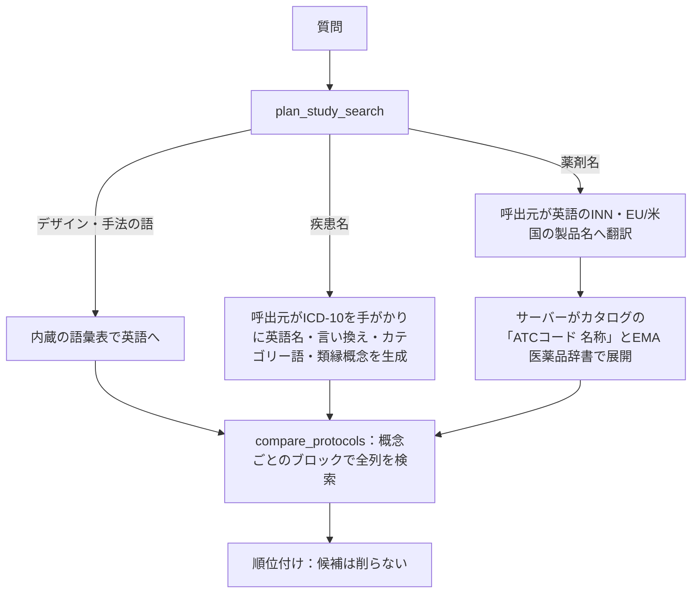

# 検索語の展開と順位付け

検索の対象はEMAカタログのメタデータ（英語）です。
質問の中の概念は、まず英語の検索語に展開されます。
疾患名と薬剤名では、展開の担い手と手がかりが違います。

### 疾患名を含む場合

1. `plan_study_search`は疾患名の辞書を持たないため、日本語の疾患名には`needs_client_translation`を返します（利用者が辞書を`data/dictionaries/`に置いた場合は、その辞書で展開します）。
2. 呼出元は、指示に従ってICD-10（WHO 2019）を語彙の手がかりに使います。該当する分類の名称と包含用語を`queries`に、ブロック・章の名称や包括的なアウトカム名（MACEなど）を`category_terms`に入れます。除外（Excludes）の語は使いません。同じブロックの別分類は類縁概念（`sibling`）、ブロック・章は上位概念（`broader`）です。
3. `compare_protocols`は、各検索語を1つの語句としてカタログの全列で検索します。複数語の語句は、語が同じ列の中で近くに現れること（FTS5の`NEAR`）を条件にします。ICD-10コードは小数点の有無の両方で照合しますが、カタログにはほとんど現れません。
4. 0件のときは検索を広げずに、類縁概念とその件数を示します（`analogous_fallback`）。

### 薬剤名を含む場合

1. 日本語の薬剤名は呼出元が英語に訳します。呼出元は、INN、EU・米国の製品名、略語（TNFi、DOACsなど）、語形やハイフン表記の変種も渡します。
2. サーバーは各検索語を、EMA医薬品辞書とカタログの医薬品名に、1つの医薬品名として語全体で照合します。長い語の一部では展開しません（例：GLP-1受容体作動薬の語からglucagonの製品へは展開しない）。検索語の末尾の塩・エステルの語（citrate、maleate、hydrochlorideなど）は除いて照合します（例：tofacitinib citrate → tofacitinibの製品）。カタログ本文の全文検索そのものは語単位なので、glucagon-likeを含む研究はglucagonでも一致します。これは検索の手がかりで、塩と遊離体を同じ製剤とはみなしません。
3. 名前どうしの対応は2つの情報源から得ます。
   - **EMA医薬品辞書**：製品名とINNを、成分の組み合わせ全体が同じ製品どうしで展開します。合わせ剤は単剤と同一視しません。
   - **カタログ自身の記載**：exposures欄の`(B01AF02) apixaban`のような「ATCコード 名称」の組です。
4. ATCコードは名前どうしをつなぐ内部の手がかりとしてだけ使い、情報源をまたいでコードで照合することはしません。コードの名称はカタログの記載から引きます。EMA医薬品辞書の記録が持つATCコードは、記録の名前とカタログのそのコードの名称が同じ薬か、名前が広い・狭いだけの関係のときだけ、カタログの名称やクラスへの手がかりに使います（辞書のコードがカタログでは別の薬に付いていることがあるため。コードだけで照合することはしません）。辞書のコードそのものは検索語には使わず、取得したプロトコルPDFの中を探すときのヒントにも使います。版の違うコード（例：afatinibのL01XE13とL01EB03）は、同じ名前でまとまります。
5. 展開のしかたは入力によって変わり、加えた語は`medicine_expansion`に返ります。
   - **成分・製品**（第5レベル）：カタログ上の名称を検索語に加えます（カタログの名称の方が広い、たとえば株や型を書かない名称のときは、検索語ではなく`category_terms`に加え、記録に無い株や型を書く狭い名称のときは加えません）。上位の第4レベルのクラス（コードと、カタログに記載があれば名称）は、カタログにそのクラスか他の所属薬の記載があるときだけ`category_terms`として加え、クラス名でしか書かれていない研究を後方の候補として拾います。
   - **クラス**（カタログのクラス名称と完全に一致するクラス名、または第3・第4レベルのATCコード）：クラスの名称と、カタログとEMA医薬品辞書でそのクラスに属する薬の名前を、検索語に加えます（1問あたり100語まで）。カタログがそのコードを別の名前で記録しているEMAの記録は加えず、`omitted_members`に理由とともに全件返します（名前がATCの名称と違うだけの所属薬と、辞書のコードの誤りがあるため。呼出元がクラスに属すると判断したものを加えて検索し直します）。
6. 該当する研究が0件で、呼出元が第5レベルのATCコードを渡していた場合は、同じクラス（第4レベルに名称が無ければ第3レベル）とカタログにある所属薬を類縁概念として示します。類縁概念の候補も、通常の検索と同じ順位付けで並べます。
7. カタログの医薬品欄が空の研究（712件）のうち215件は、補完コマンド（[開発ガイド](../README_DEV.md#カタログ取込の内部仕様)）で医薬品を補っています。補った薬は医薬品の列で検索され、候補の`observed_exposures`に出所付きで出ます。
   - **`protocol_pass_table`**（76件）：プロトコルのPASS情報表の「Active substance」「Medicinal product」欄に書かれた、既知の薬の名前、カタログのクラス名（例：`DIURETICS`）、欄に書かれたATCコード。名前の分からない薬（辞書に無い薬）は、欄に書かれたATCコードで記録します。カタログにそのコードの名称があればその名称を、無ければコード自体（例：`A07DA03`）を名前にし、コードでも検索できます。プロトコル本文のATCコードは、除外基準・アウトカム・共変量にも使われるので記録しません。
   - **`catalogue_text`**：題名・説明・目的に書かれた既知の薬の名前。比較対照や除外基準の薬であることもあるので、プロトコルで確かめてください。研究の略称と同じ名前（`SONATA study`）、検査値として書かれた物質名（呼気NO）、受容体や阻害薬のクラス名の一部（`angiotensin II receptor blockers`の angiotensin II）は補いません。

### 順位付け

候補は削らずに、次の順で並べます。

1. プロトコルが公開されていないと確認された研究、テキスト層の無いPDF（画像だけ）の研究は最後（PDFの取得で分かった事実はカタログとは別に保存され、カタログを更新しても消えません）
2. 固有の語で一致したブロックが多い研究（カテゴリー語だけの一致は後ろ）
3. 役割の列（題名と、Outcomes・Medicinal condition・薬剤欄など役割ごとの列）で一致したブロックが多い研究
4. CSVにプロトコルの所在（Protocol file・URL）がある研究、または取得でプロトコルが見つかった研究
5. 二次利用データ（カタログの種別タグあり）の研究を前に、調査（題名にsurvey）・横断研究を後ろに
6. 検索語ごとのBM25順位を統合した値（RRF、k=20）
